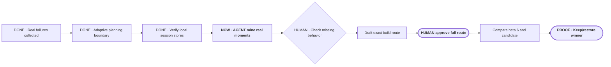

# Make Portable Planner diligent before it acts

**Status:** planning

**Destination:** During project work, Portable Planner recognizes when the outcome is still being shaped, helps Drew and the agent reach the same understanding, and prevents implementation or testing from running ahead of that understanding.

**Success:** The activation boundary is explicit; private historical Codex/ZCode evidence determines the test inventory; every retained case states exactly what it can prove and what bad assumption it must catch; the minimum useful decision-point set determines any replay count; and a worse version is never left installed.

**Now:** Privately index real Codex/ZCode sessions and surface a redacted case set.

**Next:** Replace the superseded draft execution route with the approved implementation and comparison sequence.

**Text route:** DONE adaptive planning boundary → DONE verify local Codex/ZCode stores → NOW AGENT privately mine and redact real planning moments → HUMAN check only for missing behavior → replace the superseded build route → replay only selected decision points against beta 6 and a candidate → keep beta 6 or prove the candidate → smallest fresh human test

## Confirmed boundary and current decision

Example boundaries:

- “What does 30 runs mean?” receives a direct explanation; it does not create a new planning route.
- “We need to improve Portable Planner, but I do not trust the proposed tests” automatically starts or resumes planning.
- “Implement the already approved E-010 ticket” uses the normal build workflow.

The confirmed boundary is unresolved project/product work: planning activates when destination, scope, success, proof, or a meaningful human tradeoff is still being negotiated. Narrow facts, status, explanation, diagnosis-only work, and sufficiently specified builds remain direct.

There is no current human-owned test-count decision. The [historical corpus inventory](evidence/P-002-test-inventory.md) verifies that real session evidence is available and defines the privacy and normalization boundary. The agent must first surface materially different redacted cases; only then should Drew judge whether an important behavior is absent.

## Plan-wide safety

- The former 30-run allocation is withdrawn.
- Real session evidence and explicit behavior claims come before authored prompts.
- Raw Codex/ZCode transcripts remain local, private, read-only, and untracked.
- Historical cases replace full synthetic conversations; only selected decision points are replayed when a candidate needs counterfactual proof.
- Each test has an exact starting state, expected route, prohibited behavior, and human judgment.
- Repetition requires observed variance or protected high risk.
- Expert skills and outside mechanisms supply selective evidence, not product authority; Portable Planner's protocol and cross-domain scope remain its own.
- Beta 5 and beta 6 remain immutable and recoverable.

Details: [plan](PLAN.md) · [current decision](decisions/P-002-engineer-the-improvement-loop.md) · [historical corpus](evidence/P-002-test-inventory.md) · [research evidence](evidence/P-002-expert-engineering-evidence.md)
