# Make Portable Planner diligent before it acts

**Status:** planning

**Destination:** Portable Planner recognizes when an outcome is still being shaped, helps Drew and the agent reach the same understanding, and makes even a large plan genuinely comprehensible before implementation or testing runs ahead.

**Success:** Each improvement starts from a named real failure, preserves already-good behavior, and survives objective checks plus uncoached real use before it is described as proven.

## Journey

```mermaid
flowchart LR
    M1["DONE · 1 · Recover evidence"]
    M2["DONE · 2 · Inventory nine issues"]
    M3["DONE · 3 · Select focus-lens route"]
    M4["DONE · 4 · Freeze six claims"]
    M5["DONE · 5 · Implement candidate"]
    M6["DONE · 6 · Compare and protect"]
    M7["DONE · 7 · Authorize field candidate"]
    M8(["NOW · FIELD · 8 · Use normally"])
    M1 --> M2 --> M3 --> M4 --> M5 --> M6 --> M7 --> M8

    classDef current stroke-width:3px,font-weight:700;
    classDef milestone stroke-width:2px;
    classDef proof stroke-width:3px,font-weight:700;
    class M8 current;
    class M1,M2,M3,M4,M5,M6,M7 milestone;
```

**Text route:** DONE · 1 · Recover evidence → DONE · 2 · Inventory nine issues → DONE · 3 · Select focus-lens route → DONE · 4 · Freeze six claims → DONE · 5 · Implement candidate → DONE · 6 · Compare and protect → DONE · 7 · Authorize field candidate → NOW · FIELD · 8 · Use normally

## Focus lens

- **Current outcome:** Beta 7 runs as the same default planning candidate in Codex and ZCode while real projects supply the missing human evidence.
- **Next action:** Use either harness normally; no special prompt or manufactured test conversation is needed.
- **Human role:** After enough ordinary use, ask for the local Codex and ZCode histories to be reviewed for recurring successes and failures.
- **Proof:** Objective checks protect existing behavior now; later redacted real-session evidence decides whether the candidate improved comprehension and the broader flow.
- **Recovery:** A material field regression restores the immutable beta-6 release; isolated failures reopen only the affected issue.

## Quiet rail

- **Remaining:** ordinary field use · local history review · then I-02 through I-09 one issue at a time from observed evidence
- **Guardrails:** Raw histories stay local · no arbitrary run count · no second state tree · no renderer or app · public preview is not production proof · beta 6 remains recoverable

## Optional detail

Beta-7 field boundary

- Outcome: recurring evidence from ordinary Codex and ZCode planning
- Owner: Drew
- Inputs: real projects and local session histories; no coached scripts
- Proof: redacted observed behavior plus Drew's judgment after normal use
- If blocked or changed: preserve the first concrete failure and restore beta 6 only for a material regression

Details: [plan](PLAN.md) · [current ticket](execution/E-021-publish-beta7-field-candidate.md) · [objective evidence](../validation/I01-CANDIDATE-TEST.md)
