# Make Portable Planner measurably better

**Status:** awaiting approval

**Destination:** Portable Planner chooses the right next planning action with less user effort and proves that a later revision is better than beta 6 without weakening safety, authority, or durable state.

**Success:** A candidate fixes one baseline-demonstrated failure, keeps every hard gate perfect across regression and held-out runs, avoids material non-target regression, passes Drew's uncoached test, and restores beta 6 automatically after any failure.

**Now:** Option A and the complete bounded execution route are ready for Drew's approval.

**Next:** After explicit approval, begin E-010 and preserve `v0.1.0-beta.6` as the immutable baseline.

```mermaid
flowchart LR
    B6["SAFE · Immutable beta 6"]
    A(["NOW · HUMAN approve route"])
    K["E-010 · Decision kernel"]
    H["E-011 · Frozen eval harness"]
    M["E-012 · 12-run baseline"]
    C["E-013 · One candidate change"]
    V{"E-014 · Better?"}
    T["E-015 · HUMAN fresh test"]
    R(["E-016 · Proven release"])
    KEEP["REJECT · Keep/restore beta 6"]
    B6 --> A --> K --> H --> M --> C --> V
    V -->|yes| T -->|pass| R
    V -->|worse or unclear| KEEP
    T -->|fail or worse| KEEP

    classDef current stroke-width:3px,font-weight:700;
    classDef milestone stroke-width:2px;
    classDef proof stroke-width:3px,font-weight:700;
    classDef blocked stroke-width:3px;

    class A current;
    class B6,K,H,M,C,T milestone;
    class V,R proof;
    class KEEP blocked;
```

**Text route:** SAFE immutable beta 6 → NOW HUMAN approve → define the decision kernel → freeze the evaluation harness → measure twelve unchanged baseline runs → make one targeted candidate change → compare with twelve candidate runs → if worse or unclear, reject and keep beta 6 → if objectively better, HUMAN fresh test → on failure restore beta 6; on pass publish the proven prerelease

## Step details

NOW · HUMAN approve the route

- Outcome: The bounded experiment and rollback policy receive explicit build authorization.
- Owner: Drew.
- Inputs: [confirmed decision](decisions/P-002-engineer-the-improvement-loop.md), [expert evidence](evidence/P-002-expert-engineering-evidence.md), and E-010 through E-016.
- Proof: Direct approval changes lifecycle state to `approved for build` and makes E-010 eligible.
- If blocked or changed: Reopen only P-002; beta 6 and its public installation remain untouched.

E-010 · Define the decision kernel

- Outcome: One normative contract covers prerequisites, ownership, legal actions, state mutation, and protected gates.
- Owner: Agent.
- Inputs: P-002, expert evidence, current canonical references.
- Proof: Every current behavior class maps to one non-conflicting transition and deterministic invariant set.
- If blocked or changed: Return an unresolved ownership or safety tradeoff to planning; add no infrastructure.

E-011 · Freeze the evaluation harness

- Outcome: Six visible and two held-out scenarios run from fresh isolated state with exact trace capture.
- Owner: Agent.
- Inputs: Decision kernel and existing fixtures.
- Proof: Corpus hashes, objective validators, judgment rubric, version attribution, isolation, and early stop all pass before baseline work.
- If blocked or changed: Use exact manual runs rather than weakening evidence integrity.

E-012 · Measure beta 6

- Outcome: Six visible scenarios run twice establish beta 6's failures, scores, cost, and ordinary variance.
- Owner: Agent.
- Inputs: Immutable `v0.1.0-beta.6` and frozen harness.
- Proof: Twelve append-only attributable runs preserve every output and select at most one observed failure class.
- If blocked or changed: If no meaningful failure appears, make no candidate; take unchanged beta 6 to human acceptance.

E-013 · Make one candidate change

- Outcome: One isolated branch receives the smallest causal correction to the selected failure.
- Owner: Agent.
- Inputs: Baseline report and pre-registered assertion.
- Proof: Minimal diff, static/package proof, and a written causal claim exist before candidate runs.
- If blocked or changed: Return to planning rather than add a second skill, state tree, service, or broad rewrite.

E-014 · Compare, keep, or reject

- Outcome: Twelve candidate runs produce exactly one objective verdict.
- Owner: Agent.
- Inputs: Affected cases, unrelated regression cases, held-out cases, and baseline run ranges.
- Proof: Zero hard failures, consistent target fix, no new held-out missed decision, and no material non-target regression are required to keep the candidate.
- If blocked or changed: Worse or inconclusive means reject; do not merge or spend more runs to force a pass.

E-015 · HUMAN fresh acceptance

- Outcome: Drew judges the objectively passing candidate in one new uncoached task.
- Owner: Drew; agent controls installation and rollback.
- Inputs: Kept candidate, verified temporary installation, and dedicated empty test project.
- Proof: Exact visible trace plus Drew's speed, question-value, usefulness, and “nothing worse” verdict.
- If blocked or changed: Immediately reinstall and verify public beta 6; reject the candidate.

E-016 · Publish only the proven candidate

- Outcome: A human-passed candidate alone reaches `main`, tag, prerelease, marketplace, and public installation.
- Owner: Agent.
- Inputs: Objective comparison and human acceptance.
- Proof: Source, remote main, tag, release, marketplace, installed bytes, validators, and evidence agree.
- If blocked or changed: Restore beta 6 and report the release blocker without changing quality claims.

## Plan-wide safety

- `v0.1.0-beta.6` is immutable and permanently recoverable.
- Establish the baseline before changing the skill.
- One demonstrated failure class permits one candidate change.
- Twenty-four automated fresh-task runs is the first-cycle ceiling.
- Worse or inconclusive means reject; safety failures stop immediately.
- A temporary human-test failure restores public beta 6 before handoff.

Details: [plan](PLAN.md) · [confirmed decision](decisions/P-002-engineer-the-improvement-loop.md)
