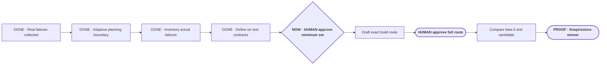

# Make Portable Planner diligent before it acts

**Status:** planning

**Destination:** During project work, Portable Planner recognizes when the outcome is still being shaped, helps Drew and the agent reach the same understanding, and prevents implementation or testing from running ahead of that understanding.

**Success:** The activation boundary is explicit; real failures determine the test inventory; every test states exactly what it can prove and what bad assumption it must catch; the minimum useful case set determines the run count; and a worse version is never left installed.

**Now:** Approve or revise the exact evidence-derived test inventory.

**Next:** Replace the superseded draft execution route with the approved implementation and comparison sequence.

**Text route:** DONE adaptive planning boundary → DONE inventory actual failures → DONE define six exact contracts containing eight independent starting-state units → NOW HUMAN approve or revise the minimum set → replace the superseded build route → compare beta 6 and candidate on identical cases → keep beta 6 or prove the candidate → smallest fresh human test

## Confirmed boundary and current decision

Example boundaries:

- “What does 30 runs mean?” receives a direct explanation; it does not create a new planning route.
- “We need to improve Portable Planner, but I do not trust the proposed tests” automatically starts or resumes planning.
- “Implement the already approved E-010 ticket” uses the normal build workflow.

The confirmed boundary is unresolved project/product work: planning activates when destination, scope, success, proof, or a meaningful human tradeoff is still being negotiated. Narrow facts, status, explanation, diagnosis-only work, and sufficiently specified builds remain direct.

The current decision is whether the six exact contracts in [the test inventory](evidence/P-002-test-inventory.md) are the right minimum. They produce eight independent first-pass conversations per compared version because the direct-route contract has separate status, diagnosis, and approved-build starting states. No repeated runs are proposed before variance appears.

## Plan-wide safety

- The former 30-run allocation is withdrawn.
- Real failures and explicit behavior claims come before authored prompts.
- Each test has an exact starting state, expected route, prohibited behavior, and human judgment.
- Repetition requires observed variance or protected high risk.
- Expert skills and outside mechanisms supply selective evidence, not product authority; Portable Planner's protocol and cross-domain scope remain its own.
- Beta 5 and beta 6 remain immutable and recoverable.

Details: [plan](PLAN.md) · [current decision](decisions/P-002-engineer-the-improvement-loop.md) · [test inventory](evidence/P-002-test-inventory.md) · [research evidence](evidence/P-002-expert-engineering-evidence.md)
