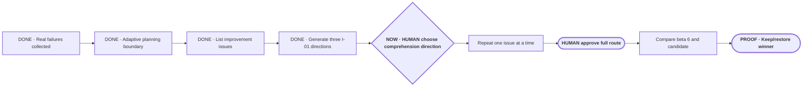

# Make Portable Planner diligent before it acts

**Status:** planning

**Destination:** Portable Planner recognizes when an outcome is still being shaped, helps Drew and the agent reach the same understanding, and makes even a large plan genuinely comprehensible before implementation or testing runs ahead.

**Success:** Improvement problems are listed before solutions; each problem is solved and proved separately; a large plan reveals destination, current position, next action, important gates, and relevant detail without forcing Drew through Mermaid or a report; and a worse version is never left installed.

**Now:** Drew selects or refines one of three displayed I-01 visual directions.

**Next:** Replace the superseded draft execution route with the approved implementation and comparison sequence.

**Text route:** DONE evidence and local-history access → DONE initial nine-issue inventory → DONE research I-01 solution families → DONE generate three directions from the real GOMER brief → NOW HUMAN choose or refine the useful direction → build one faithful disposable prototype → repeat the issue loop → build only approved corrections → keep beta 6 or prove the candidate → smallest fresh human test

## Confirmed boundary and current decision

Example boundaries:

- “What does 30 runs mean?” receives a direct explanation; it does not create a new planning route.
- “We need to improve Portable Planner, but I do not trust the proposed tests” automatically starts or resumes planning.
- “Implement the already approved E-010 ticket” uses the normal build workflow.

The confirmed boundary is unresolved project/product work: planning activates when destination, scope, success, proof, or a meaningful human tradeoff is still being negotiated. Narrow facts, status, explanation, diagnosis-only work, and sufficiently specified builds remain direct.

There is no current human-owned test-count decision. The [improvement inventory](evidence/P-002-improvement-issues.md) defines nine problems or regression constraints. [I-01 research](evidence/P-002-I-01-plan-comprehension.md) contains the pattern evidence and stable concept images. Drew now chooses or refines their information hierarchy before one faithful interactive prototype is built.

## Plan-wide safety

- The former 30-run allocation is withdrawn.
- Real session evidence and explicit behavior claims come before authored prompts.
- Raw Codex/ZCode transcripts remain local, private, read-only, and untracked.
- Historical cases replace full synthetic conversations; only selected decision points are replayed when a candidate needs counterfactual proof.
- Mermaid rendering is not accepted as proof of comprehension; the solution must work on an actual large plan.
- Solve one confirmed issue at a time and preserve objectively passing behaviors as regression guards.
- Each test has an exact starting state, expected route, prohibited behavior, and human judgment.
- Repetition requires observed variance or protected high risk.
- Expert skills and outside mechanisms supply selective evidence, not product authority; Portable Planner's protocol and cross-domain scope remain its own.
- Beta 5 and beta 6 remain immutable and recoverable.

Details: [plan](PLAN.md) · [current decision](decisions/P-002-engineer-the-improvement-loop.md) · [improvement inventory](evidence/P-002-improvement-issues.md) · [I-01 comprehension research](evidence/P-002-I-01-plan-comprehension.md) · [historical corpus](evidence/P-002-test-inventory.md)
