# Make Portable Planner diligent before it acts

**Status:** planning

**Destination:** Portable Planner recognizes when an outcome is still being shaped, helps Drew and the agent reach the same understanding, and makes even a large plan genuinely comprehensible before implementation or testing runs ahead.

**Success:** Each improvement starts from a named real failure, preserves already-good behavior, and survives objective checks plus uncoached real use before it is described as proven.

## Journey

```mermaid
flowchart LR
    M1["DONE · 1 · Define decisive behavior"]
    M2["DONE · 2 · Ship beta 6"]
    M3["DONE · 3 · Inventory real issues"]
    M4["DONE · 4 · Select focus-lens route"]
    M5["DONE · 5 · Ship beta 7 candidate"]
    M6["DONE · FIELD · 6 · Gather ordinary use"]
    M7["DONE · REVIEW · 7 · Attribute beta 7"]
    M8["DONE · 8 · Repair one proven failure"]
    M9(["NOW · HUMAN · PROOF · 9 · Use beta 8 normally"])
    M1 --> M2 --> M3 --> M4 --> M5 --> M6 --> M7 --> M8 --> M9

    classDef current stroke-width:3px,font-weight:700;
    classDef milestone stroke-width:2px;
    classDef proof stroke-width:3px,font-weight:700;
    class M9 current,proof;
    class M1,M2,M3,M4,M5,M6,M7,M8 milestone;
```

**Text route:** DONE · 1 · Define decisive behavior → DONE · 2 · Ship beta 6 → DONE · 3 · Inventory real issues → DONE · 4 · Select focus-lens route → DONE · 5 · Ship beta 7 candidate → DONE · FIELD · 6 · Gather ordinary use → DONE · REVIEW · 7 · Attribute beta 7 → DONE · 8 · Repair one proven failure → NOW · HUMAN · PROOF · 9 · Use public beta 8 normally, then judge field behavior

## Focus lens

- **Current outcome:** Beta 8 is merged, tagged, published as a prerelease, and installed as the sole enabled Portable Planner from the public marketplace.
- **Next action:** Use Portable Planner normally in fresh tasks; after enough sessions expose a useful pattern, request the bounded audit.
- **Human role:** Judge the first qualifying late-mutation behavior and whether the final-write barrier adds noticeable burden; no coached replay is required.
- **Proof:** The real beta-7 trace establishes the defect. The post-beta-7 candidate rejects both software and event late-write orders, accepts the repaired orders, and leaves no-write and ordinary non-terminal replies alone.
- **Recovery:** If field use still hands off after an unchecked late mutation or adds broad ceremony, restore the beta-7 wording and reopen I-10 from the new trace.

## Quiet rail

- **Remaining:** ordinary-use traces · bounded audit · Drew's correctness and burden judgments
- **Guardrails:** Raw histories stay local · report is not causality · no arbitrary run count · no second state tree · no unsupported change · public beta 7 remains recoverable

## Optional detail

Beta-7 field boundary

- Outcome: recurring evidence from ordinary Codex and ZCode planning
- Owner: Drew
- Inputs: real projects and local session histories; no coached scripts
- Proof: redacted observed behavior plus Drew's judgment after normal use
- If blocked or changed: preserve the first concrete failure and restore beta 6 only for a material regression

Details: [plan](PLAN.md) · [beta-8 publication](execution/E-023-publish-beta8-field-candidate.md) · [improvement inventory](evidence/P-002-improvement-issues.md)
