# Make Portable Planner decisive and brief

**Status:** approved for build

**Destination:** Short, decisive planning that stops grilling when discussion is exhausted, then proactively moves finished work into approval and live testing while preserving human control.

**Success:** Fresh varied sessions prove delegated choices proceed without extra questions, bounded trials replace unproductive discussion, and the planner clearly pushes completed work into approval and the right live test without crossing protected gates.

**Now:** E-001 through E-007 are complete. Beta 5 is integrated and published as an honest public-preview prerelease; objective repaired-interaction, package, install, and fresh natural-invocation checks pass.

**Next:** Drew reruns the remaining human acceptance in a new task.

```mermaid
flowchart LR
    H["DONE · HUMAN approved plan"]
    E1["DONE · Lock behavior contract"]
    E2["DONE · Update canonical skill"]
    E3["DONE · Prove varied behavior"]
    E4["DONE · Live failures captured"]
    E5["DONE · Repair shared behavior"]
    E6["DONE · Rerun release checks"]
    E7["DONE · Integrate prerelease"]
    D(["NOW · HUMAN beta-5 acceptance"])
    H --> E1 --> E2 --> E3 --> E4 --> E5 --> E6 --> E7 --> D

    classDef current stroke-width:3px,font-weight:700;
    classDef milestone stroke-width:2px;
    classDef proof stroke-width:3px,font-weight:700;

    class D current;
    class H,E1,E2,E3,E4,E5,E6,E7 milestone;
```

**Text route:** HUMAN approved plan → DONE lock behavior contract → DONE update the one canonical skill → DONE synthetic proof → DONE capture beta.4 live failures → DONE repair only demonstrated shared behavior → DONE affected and package checks → DONE integrate and publish an honest prerelease → NOW HUMAN rerun remaining acceptance.

## Step details

DONE · HUMAN approved plan

- Outcome: Building is explicitly authorized.
- Owner: Drew.
- Inputs: Finished plan, confirmed decision, and evidence.
- Proof: Drew explicitly approved on 2026-08-07.
- If blocked or changed: Reopen only the affected decision.

DONE · E-001 · Lock behavior contract

- Outcome: Product and acceptance documents define the new behavior consistently.
- Owner: Agent.
- Inputs: P-001 and recorded live failures.
- Proof: Authority documents agree without claiming proven effectiveness.
- If blocked or changed: Return conflicting product tradeoffs to planning.

DONE · E-002 · Update canonical skill

- Outcome: One skill implements brevity, explicit delegation, stopping, bounded trials, immediate action, proactive approval and test handoffs, and protected gates.
- Owner: Agent.
- Inputs: Locked behavior contract.
- Proof: References resolve and adapters remain thin.
- If blocked or changed: Record the instruction failure before adding architecture.

DONE · E-003 · Prove varied behavior

- Outcome: Normal, contrasting, and failure cases pass across software and non-software planning.
- Owner: Agent.
- Inputs: Updated canonical skill and fixtures.
- Proof: Preserved inputs, outputs, variations, failures, and changed decisions.
- If blocked or changed: Make a targeted revision and rerun affected cases.

DONE · E-004 · HUMAN live acceptance

- Outcome: A genuine fresh session preserved both passing behavior and concrete failures.
- Owner: Shared.
- Inputs: Passing package and an ordinary fresh request.
- Proof: Drew's direct judgments and the preserved beta.4 trace.
- If blocked or changed: Reopen only the affected shared behavior.

DONE · E-005 · Repair shared behavior

- Outcome: Fix delegation invitation, digression choices, provisional research direction, test intake, visual freshness, and fallback behavior in the one canonical skill.
- Owner: Agent.
- Inputs: Recorded beta.4 failures and Drew's confirmed corrections.
- Proof: Product and skill contracts agree without domain-specific instructions or new architecture.
- If blocked or changed: Return only a genuinely new product tradeoff to planning.

DONE · E-006 · Rerun release checks

- Outcome: Fresh affected cases and full package checks pass on the unchanged repaired candidate.
- Owner: Agent.
- Inputs: E-005 candidate and preserved failure assertions.
- Proof: Raw outputs, package validation, link/state audits, installer proof, and honest acceptance reconciliation.
- If blocked or changed: Repair only the failed shared instruction and rerun affected cases.

DONE · E-007 · Integrate prerelease

- Outcome: Reviewed changes reach remote `main`, a matching tag, and a GitHub prerelease.
- Owner: Agent; Drew supplies remaining post-install human acceptance.
- Inputs: Passing E-006 candidate.
- Proof: Remote hashes, merged PR, tag, release, clean worktree, and explicit remaining gates.
- If blocked or changed: Push the branch and record the exact release blocker without a false production claim.

NOW · HUMAN beta-5 acceptance

- Outcome: Direct judgment of the repaired interaction, current-state refresh, and supported visual fallback in a fresh task.
- Owner: Drew.
- Inputs: Installed public beta 5 and an ordinary real planning request.
- Proof: Remaining checks in `docs/ACCEPTANCE.md` are updated from the actual run.
- If blocked or changed: Record the exact failure and reopen only its shared behavior.

## Plan-wide safety

- Never infer delegation from repeated agreement.
- Never delegate irreversible commitments, personal tradeoffs, conflicts, implementation, or final approval.
- Trials are planning evidence, not production work.
- Keep one canonical skill and one project-local planning state.
- Record live failures before architecture expands.
- Keep ordinary replies short; reveal details only when requested or required for safety.

Details: [plan](PLAN.md) · [confirmed decision](decisions/P-001-define-decisive-planning.md)
