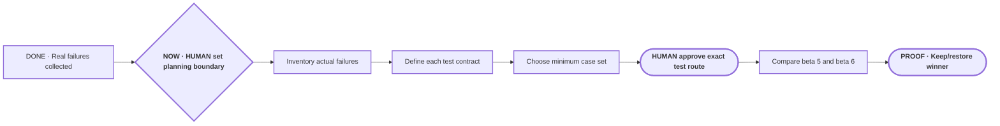

# Make Portable Planner diligent before it acts

**Status:** planning

**Destination:** During project work, Portable Planner recognizes when the outcome is still being shaped, helps Drew and the agent reach the same understanding, and prevents implementation or testing from running ahead of that understanding.

**Success:** The activation boundary is explicit; real failures determine the test inventory; every test states exactly what it can prove and what bad assumption it must catch; the minimum useful case set determines the run count; and a worse version is never left installed.

**Now:** Decide when unresolved conversation should automatically become Portable Planner planning.

**Next:** Inspect the saved real tasks and failures, then shape the smallest discriminating test set with Drew before any automated runs.

**Text route:** DONE real live failures and task history → NOW HUMAN settle when planning activates automatically → inventory actual failure claims → define each exact test conversation and prohibited assumption → choose the minimum case set and only then its run count → HUMAN approve the exact test route → compare beta 5 and beta 6 → keep or restore the proven winner

## Current decision

Example boundaries:

- “What does 30 runs mean?” receives a direct explanation; it does not create a new planning route.
- “We need to improve Portable Planner, but I do not trust the proposed tests” automatically starts or resumes planning.
- “Implement the already approved E-010 ticket” uses the normal build workflow.

The recommended boundary is unresolved project/product work: planning activates when destination, scope, success, proof, or a meaningful human tradeoff is still being negotiated. Narrow facts, status, explanation, diagnosis-only work, and sufficiently specified builds remain direct.

## Plan-wide safety

- The former 30-run allocation is withdrawn.
- Real failures and explicit behavior claims come before authored prompts.
- Each test has an exact starting state, expected route, prohibited behavior, and human judgment.
- Repetition requires observed variance or protected high risk.
- Expert skills supply evidence, not product authority.
- Outside mechanisms are selectively adapted; Portable Planner's protocol and cross-domain scope remain its own.
- Beta 5 and beta 6 remain immutable and recoverable.

Details: [plan](PLAN.md) · [current decision](decisions/P-002-engineer-the-improvement-loop.md) · [evidence](evidence/P-002-expert-engineering-evidence.md)
