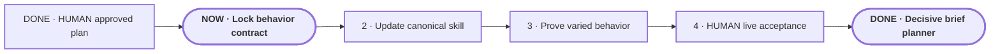

# Make Portable Planner decisive and brief

**Status:** approved for build

**Destination:** Short, decisive planning that stops grilling when discussion is exhausted, then proactively moves finished work into approval and live testing while preserving human control.

**Success:** Fresh varied sessions prove delegated choices proceed without extra questions, bounded trials replace unproductive discussion, and the planner clearly pushes completed work into approval and the right live test without crossing protected gates.

**Now:** E-001 is ready: lock the approved behavior into product authority and acceptance documents.

**Next:** E-002 updates the one canonical skill.

**Text route:** HUMAN approved plan → NOW lock behavior contract → update the one canonical skill → prove normal, tricky, and failure cases across project types → HUMAN try it live → accept only with real evidence.

## Step details

DONE · HUMAN approved plan

- Outcome: Building is explicitly authorized.
- Owner: Drew.
- Inputs: Finished plan, confirmed decision, and evidence.
- Proof: Drew explicitly approved on 2026-08-07.
- If blocked or changed: Reopen only the affected decision.

NOW · E-001 · Lock behavior contract

- Outcome: Product and acceptance documents define the new behavior consistently.
- Owner: Agent.
- Inputs: P-001 and recorded live failures.
- Proof: Authority documents agree without claiming proven effectiveness.
- If blocked or changed: Return conflicting product tradeoffs to planning.

E-002 · Update canonical skill

- Outcome: One skill implements brevity, explicit delegation, stopping, bounded trials, immediate action, proactive approval and test handoffs, and protected gates.
- Owner: Agent.
- Inputs: Locked behavior contract.
- Proof: References resolve and adapters remain thin.
- If blocked or changed: Record the instruction failure before adding architecture.

E-003 · Prove varied behavior

- Outcome: Normal, contrasting, and failure cases pass across software and non-software planning.
- Owner: Agent.
- Inputs: Updated canonical skill and fixtures.
- Proof: Preserved inputs, outputs, variations, failures, and changed decisions.
- If blocked or changed: Make a targeted revision and rerun affected cases.

E-004 · HUMAN live acceptance

- Outcome: Drew judges a genuine fresh planning session concise, decisive, controllable, and clear about when and how to test it.
- Owner: Shared.
- Inputs: Passing package and an ordinary fresh request.
- Proof: Drew's direct judgment plus preserved trace.
- If blocked or changed: Record the failure and reopen only affected behavior.

## Plan-wide safety

- Never infer delegation from repeated agreement.
- Never delegate irreversible commitments, personal tradeoffs, conflicts, implementation, or final approval.
- Trials are planning evidence, not production work.
- Keep one canonical skill and one project-local planning state.
- Record live failures before architecture expands.
- Keep ordinary replies short; reveal details only when requested or required for safety.

Details: [plan](PLAN.md) · [confirmed decision](decisions/P-001-define-decisive-planning.md)
