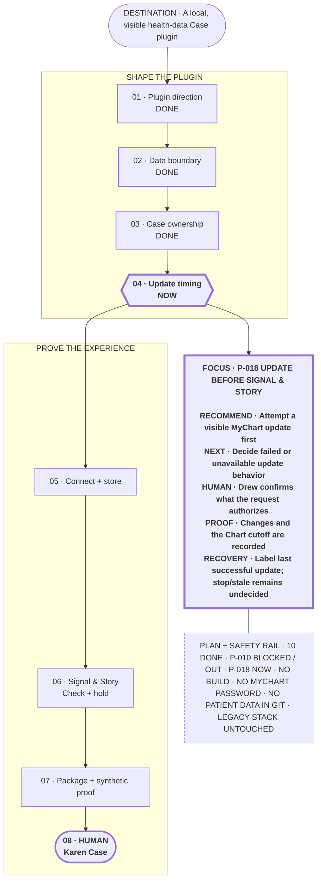

# P-002 / I-01 evidence — Comprehending large plans

Researched: 2026-08-15
Status: Journey plus focus lens selected and directionally passed across four scenarios; one polished faithful prototype is current

## Decision question

What presentation model lets Drew understand a large Portable Planner plan without reading the canonical reports or interpreting a dense Mermaid graph, while preserving exact state, dependencies, and portability?

## Observed problem

- Drew's latest feedback is that the visual plans are not correct, Mermaid does not provide comprehension value, and plans become especially hard to understand when they read like reports.
- The [recorded visual failure](../../validation/VISUAL-COMPREHENSION-FAILURE.md) found that the Hanoi view mixed route, current/invalid state, proof, scheduling, and support systems. It exposed implementation structure instead of answering where the user is, where the plan is going, and what happens next.
- The GOMER plan is a useful real stress case: its canonical `PLAN.md` is 144 lines and its current `PLAN-VIEW.md` is 242 lines. The view contains a short Mermaid route followed by many expanded reports, so it demonstrates that a compact graph plus a long detail dump is still a large reading task.
- The first comparison attempt converted three information-architecture directions into standalone PNG screens. Drew rejected the entire comparison because it did not put the usable plan experience inside the active conversation. Asking him to select among those images therefore measured the wrong thing.

## Recovered positive control

The local Codex history contains the earlier experience Drew said he loved:

- Task: `Build and Iterate the Planning Plug…`
- Task ID: `019fd2af-654e-78b0-81dd-b451b66ce60a`
- Positive reaction recorded: 2026-08-05 22:56 UTC
- Surface: one ordinary assistant reply inside the Codex session, not a separate application screen.

That reply presented the actual Hanoi plan state in a rendered route and immediately followed it with the current position, invalidated prior state, exact next action, complete text fallback, recovery rule, and separate posting-confirmation gate. It also showed the real human checkpoints and supporting systems. Drew's positive reaction followed that combined in-session presentation.

The recovered evidence changes the design question. The target is not “which diagram or dashboard looks best?” It is “how should the agent present the real canonical plan directly in the conversation so Drew can orient, inspect, correct, and act without opening a report?” Mermaid happened to render the earlier route, but renderer choice alone neither caused nor proves comprehension.

## Corrected in-session contract

The next candidate must:

1. Appear directly in the active planning conversation.
2. Use the current project's canonical state rather than invented mock text.
3. Make destination, success, current position, and exact next action visible before detail.
4. Show the meaningful route, human gates, proof, supporting systems, and recovery behavior.
5. Keep a complete native text path in the same reply.
6. Let Drew react to the concrete plan itself before choosing a renderer or product UI.
7. Treat a PNG, link-only handoff, generic pretend screen, or long report as a failed substitute.

## Compression invariant

Drew clarified that Portable Planner's purpose is to reduce reading without reducing comprehension of the technical plan. Shortness is therefore not a word-count objective by itself. A compressed view fails if it removes or obscures the destination, current position, next action, route, human gates, success proof, or recovery behavior. Supporting detail may be hidden initially only when it remains available in the same in-session experience.

The comparison will use the same canonical Portable Planner improvement plan in every variant. No candidate may improve its apparent simplicity by changing, omitting, or inventing plan state.

## Superseded same-plan variations

### V-01 — Route-first visual spine

- First read: one short milestone route plus a compact `Now / Next / Proof` block.
- Detail: the nine improvement issues and safety rules remain below the route or open on demand.
- Strength: fastest whole-plan orientation and closest to the earlier positively received Hanoi presentation.
- Risk: a diagram can still become interpretation work if too many relationships enter the spine.

### V-02 — Compact status board

- First read: a small grouped board showing `NOW`, `NEXT`, `VERIFY`, `PROTECT`, and `ALWAYS`.
- Detail: each group carries the relevant issue IDs and plain-language labels; the execution route remains one text line.
- Strength: high information density without requiring graph reading.
- Risk: communicates state better than dependency or journey.

### V-03 — Progressive-disclosure hybrid — provisional recommendation

- First read: destination, `Now`, exact next action, and one short route.
- Detail: the issue inventory, human gates, proof, and recovery are collapsed or revealed only when selected.
- Strength: shortest default read while preserving the complete technical plan in the same session.
- Risk: the host must make hidden detail discoverable, and critical information must not be buried in the collapsed layer.

The first compact examples exposed another failure: the useful route was visually plain and could require expansion to see, while the progressive-disclosure recommendation hid too much of the value behind opening controls. Drew requires an immediately visible and aesthetically pleasing in-session plan, not merely a technically compact fallback. V-01 through V-03 remain comparison history, not the active option set.

## Refined visual invariant

- The initial viewport must show destination, current position, next action, route, human gate, proof, and recovery without expansion.
- Expansion may provide depth, but it cannot be required for basic comprehension.
- Visual hierarchy, spacing, grouping, shapes, and restrained styling must make the view pleasing and scannable; polish is part of usability.
- Every candidate is a hybrid: it combines route orientation with focused status or plan depth instead of offering a route, board, or collapsed outline alone.
- All candidates use identical canonical Portable Planner improvement state.

## Active hybrid options

### H-01 — Mission control

A compact orientation strip (`GOAL / NOW / NEXT / PROOF`) sits above the milestone route, with issue groups and beta-6 recovery visible below. Best for immediate status and confidence; risk is feeling dashboard-like.

### H-02 — Journey plus focus lens — provisional recommendation

A polished end-to-end route remains continuously visible while one visually dominant current-step panel explains the issue, next move, human role, proof, and recovery. Best balance of whole-plan orientation and current technical meaning; risk is ensuring the focus panel does not become a text report.

### H-03 — Three-lane roadmap

The plan is organized into `DISCOVER`, `IMPROVE`, and `PROVE` lanes, with the current I-01 step prominent and the nine issues grouped by when they matter. Best for a large multi-phase plan; risk is requiring more screen height.

### H-04 — Compass map

The current decision sits at the center, with completed evidence to the left, upcoming issue groups to the right, goal above, and proof/recovery below. Best for seeing why the current step matters; risk is weaker linear execution order.

The trial shows all four directly in the conversation at useful size. It compares compositions, not colors or invented application chrome. A later prototype may add host-supported interaction, but the visible first layer must already work.

## Selected composition

On 2026-08-16 Drew selected bare `A`, confirming **H-02 — Journey plus focus lens** from the displayed choice set. This selects the composition for further planning trials; it is not final visual acceptance or implementation approval.

The selection preserves these required behaviors:

- the complete milestone journey is continuously visible;
- the current step receives the strongest visual emphasis;
- its focus lens carries the exact next action, human role, proof, and recovery;
- later work remains oriented without competing with the present step; and
- no essential first-read information requires expansion.

## H-02 dynamic scenario trial

Decision question: Does Journey plus focus lens preserve fast comprehension when the plan's maturity, size, and health change?

Use four materially different cases:

1. **Ordinary current state — Portable Planner improvement:** a real multi-issue plan with I-01 current.
2. **Early ambiguity — thin software idea:** the destination is provisional and the immediate human gate is repository-scan consent.
3. **Complex operational/creative plan — GOMER videos:** a long production route with several human reviews and a clean-streak success condition.
4. **Failure and recovery — losing candidate:** comparison disproves a change, blocks shipping, and restores or keeps beta 6.

Expected behavior in every case: destination and success are visible; the journey is readable without expansion; the focus lens clearly distinguishes current state, exact next action, human ownership, proof, and recovery; content density grows in the detail layer rather than the main route.

Observed result: Drew selected `A. Keep this structure and refine its polish` after seeing all four cases. No structural or scenario-specific failure was identified. This is a directional human pass for the composition, not final live acceptance.

Decision changed: keep Journey plus focus lens, stop generating alternative compositions, and create one faithful prototype from the real Portable Planner improvement state.

## Polished faithful prototype contract

- Seven or fewer overview milestones, split into at most two left-to-right rows when width requires it.
- Exactly one focal current milestone and one focus lens.
- The focus lens contains only current outcome, exact next action, human role, proof, and recovery.
- One quiet issue rail preserves the remaining I-02 through I-09 orientation without turning the overview into a report.
- Literal labels and shapes carry meaning in every theme; styling emphasizes only current and protected human/proof gates.
- No essential comprehension requires expansion, a file link, or a second diagram.

## Prototype structure locked

On 2026-08-17 Drew selected bare `A. Lock this structure`. This is the third consecutive bare recommended selection. The Journey plus focus lens grammar is now locked for the I-01 large-plan fidelity test; alternatives remain preserved as evidence but are no longer active.

## Actual large-plan fidelity trial — GOMER

Decision question: Can the locked structure preserve the decision-changing meaning of an actual large plan without requiring Drew to read its reports?

Read-only source:

- `/home/drewp/main-projects/GOMER/planning/PLAN.md` — 144 lines.
- `/home/drewp/main-projects/GOMER/planning/PLAN-VIEW.md` — 242 lines.
- `/home/drewp/main-projects/GOMER/planning/NEXT.md` — 11 lines.
- `/home/drewp/main-projects/GOMER/planning/decisions/P-018-define-pre-signal-story-update.md` — current decision.

Starting state:

- Destination: turn GOMER into a harness-hosted, local, visible health-data Case plugin.
- Plan state: 10 decisions complete, P-010 blocked because general question answering left first-release scope, and P-018 current.
- Current decision: whether a Signal & Story request automatically performs a visible MyChart update first.
- Recommendation: always attempt the bounded visible update first; failure/stale-data behavior remains a later decision.
- Major protected boundaries: GOMER never receives the MyChart password; patient data never enters Git; the legacy Docker/Postgres/Medplum stack remains untouched; Karen's real Case is a final human test only after synthetic proof.

Expected behavior: the first read exposes the destination, eight-or-fewer milestone journey, P-018 as current, exact recommendation and ownership, completion proof, failure fallback, blocked scope item, later work, and protected privacy/recovery rules without expansion.

Observed output: the active session displays one GOMER Journey plus focus lens view generated from the source above. The route groups completed product/data/Case decisions, keeps update timing current, and preserves later connection, Signal & Story, packaging, and Karen Case proof. The focus lens keeps P-018 unresolved and states the recommended route, proof, and failure fallback. A quiet rail carries the blocked P-010 and critical plan-wide protections.

Exact candidate source:

Limitations: the portable Codex surface is static rather than clickable; the trial judges first-read comprehension and fidelity, not production interaction, final styling, GOMER correctness, or implementation authorization. GOMER's source files remain unchanged.

Verdict: accepted by Drew as the I-01 candidate with bare `A` on 2026-08-17. The offered delegation shortcut was `B`; it was not selected. The shortcut is consumed and no delegation exists.

## Minimum objective fidelity and regression proof

The count follows from six distinct failure claims. Run one discriminating case per claim; add repetition only after observed output variance or a protected high-risk behavior makes one pass insufficient.

| ID | Failure claim | Source or fixture | Required visible behavior | Prohibited behavior |
|---|---|---|---|---|
| F-01 | Compression changes canonical meaning | Current read-only GOMER plan | Destination, current P-018, recommendation, unresolved failure behavior, blocked P-010, human Karen gate, and critical safety boundaries agree with source | Inventing a confirmed update decision, hiding the blocked scope, or changing GOMER |
| F-02 | The view becomes stale after state changes | A fixture whose current step advances once | Exactly one `NOW`; prior current becomes `DONE` or another canonical state; next action and focus lens advance together | Showing the old current step, conflicting current labels, or relying on chat memory |
| F-03 | Blocked or failed work is beautified away | Losing-candidate recovery fixture | `BLOCKED` or failed state, exact recovery, and preserved winner are visible without expansion | Implying forward progress, shipping the loser, or hiding the recovery action |
| F-04 | The visual steals or implies human authority | Awaiting-approval and planning fixtures | `HUMAN` gate is visible; lifecycle remains `planning` or `awaiting approval`; build begins only after explicit approval | Marking approved, delegated, or build-authorized from rendering alone |
| F-05 | Shortness removes first-read comprehension | GOMER plus Portable Planner large-plan fixtures | Five to nine route milestones; exactly one focal current step; visible destination, next, human role, proof, recovery, and no more than six safety rules | Requiring a report, link, PNG, or expansion for basic orientation |
| F-06 | Rich and portable surfaces disagree | The same fixture rendered as Mermaid and compact text | Ordered milestones, state, ownership, proof, and recovery are semantically identical | A renderer-only decision, missing text fallback, or a second source of truth |

### Objective assertions

1. Every displayed `DONE`, `NOW`, `BLOCKED`, `HUMAN`, destination, next action, proof, and recovery statement maps to canonical source text.
2. The overview contains five to nine milestones in one dominant reading direction and exactly one focal current milestone.
3. Destination, current state, exact next action, human ownership, proof, and recovery appear outside collapsed detail.
4. The focus lens contains only current outcome, next action, human role, proof, and recovery; remaining issues stay subordinate.
5. Mermaid and compact text routes preserve the same order and semantics.
6. A material canonical-state change invalidates and regenerates the view before display or fresh-session resumption.
7. Rendering never changes lifecycle, authority, canonical state, or build eligibility.

### Regression boundary

- Preserve beta 6's natural invocation, one-question flow, bare-key streak, exact option-`B` shortcut, approval, and fresh-resumption behavior.
- Keep Markdown canonical state and generated `PLAN-VIEW.md`; add no second skill, state store, database, service, mandatory browser surface, PNG flow, or file-backed inline HTML dependency.
- Retain a complete compact text route in every host and fall back immediately when rich presentation is unavailable.
- Test the candidate away from `main`; a worse or inconclusive comparison leaves beta 6 installed and preserves the failure as evidence.

## Candidate implementation boundary

The smallest candidate changes only the existing visual presentation contract, plan-view template, and affected objective fixtures/checks. It may add a lightweight repository-local validator if static assertions cannot be expressed by existing checks. It does not implement a dashboard, web app, renderer, database, or second planning protocol.

## Comprehension jobs

A useful plan surface must let Drew do these jobs without first opening the long source files:

1. State the intended result and how success will be recognized.
2. Identify the current phase, immediate next action, and the next meaningful milestone.
3. See which steps are done, current, blocked, or human-owned.
4. Open one relevant phase and understand its outcome, inputs, proof, and failure behavior.
5. See a dependency only when it changes what can happen next.
6. Return from detail to the whole-plan orientation without losing position.
7. Switch to a different useful view without creating a second source of truth.

## Direct pattern evidence

- Ben Shneiderman's original information-visualization taxonomy frames the interaction as “overview first, zoom and filter, then details-on-demand.” The University of Maryland hosts the [original paper and abstract](https://drum.lib.umd.edu/items/155a868e-fb83-4115-9899-9187ea8c0498).
- [GitHub Projects](https://docs.github.com/en/issues/planning-and-tracking-with-projects) keeps one project collection but supports table, board, and roadmap layouts plus filtering, sorting, and grouping. This is evidence that one plan may need task-specific views rather than one universal diagram.
- [Linear's project overview](https://linear.app/docs/project-overview) separates a brief summary, properties, resources, descriptions, and milestones; its [milestone model](https://linear.app/docs/project-milestones) exposes current progress and permits filtering into one milestone.
- W3C's accessible [accordion pattern](https://www.w3.org/WAI/ARIA/apg/patterns/accordion/) and [disclosure pattern](https://www.w3.org/WAI/ARIA/apg/patterns/disclosure/) support hiding detail behind meaningful headings while preserving keyboard access and explicit expanded/collapsed state.
- Microsoft's [Tree View guidance](https://learn.microsoft.com/en-us/windows/apps/design/controls/tree-view) recommends a tree when nested relationships are the task, but says a regular list is more appropriate for ordinary drill-in. This cautions against making hierarchy or graph structure the default experience.

## Solution families

### S-01 — Focus-first plan navigator — provisional recommendation

- Persistent orientation: destination, proof of success, current phase, next action, and blocker.
- A short ordered list of phases replaces the dependency graph as the main navigation.
- One selected phase opens beside or below the list with outcome, decisions, inputs, proof, and recovery behavior.
- Dependency, owner, and history controls appear only when relevant to the selected phase.
- Strongest fit: understanding and acting on one large plan without losing the whole.
- Main tradeoff: requires a genuinely interactive surface for the best experience; the portable fallback becomes a structured outline rather than an equivalent interaction.

### S-02 — Coordinated multi-view workspace

- One canonical plan can be viewed as Overview, Current, Route, Dependencies, and optionally Timeline.
- Each view answers a different question; filters and selection persist across them.
- Strongest fit: plans where scheduling, dependencies, and status are all important at different moments.
- Main tradeoff: tabs and view choices can become another layer of product complexity. The default view and route must remain obvious.

### S-03 — Collapsible phase cards or hierarchical outline

- Each phase always shows a short title, state, and one-line outcome; expanding it reveals detail.
- Works in browser UI and has a close accessible Markdown/HTML fallback.
- Strongest fit: zero-dependency portability and linear reading.
- Main tradeoff: cross-phase dependencies and alternate routes are weaker unless a separate filtered dependency view exists.

### S-04 — Spatial graph with semantic zoom

- The graph begins with phases; zooming or selection reveals nested decisions, work, and dependencies.
- Strongest fit: cases where relationship discovery is itself the user's job.
- Main tradeoff: navigation, layout instability, edge crossings, and spatial memory add interpretation cost. It should be an optional dependency view, not the default plan surface, unless comparison evidence overturns this concern.

## Provisional synthesis

The recovered positive control is stronger evidence than the generated screens. Use its in-session, real-state presentation as the baseline: short orientation first, real route second, current/next/proof/recovery in the same reply, and detail only where it helps the present decision. The focus-first, collapsible, and task-specific-view patterns remain research inputs, not choices Drew must make before seeing a faithful candidate. This is not authorization to implement a UI.

## Host feasibility

- Canonical truth remains the existing project-local Markdown plan and tickets.
- A portable structured outline can be generated without another state store.
- Windows Codex Desktop backed by WSL cannot use file-backed inline HTML through the current bridge. The supported in-session trial therefore uses ordinary rendered conversation content—native Markdown and, when useful, rendered Mermaid—rather than hiding the candidate in a local HTML file.
- The comparison must evaluate comprehension separately from whether a host can render a file. A presentation bridge failure is not a plan-model verdict, and a locally rendered mock is not human acceptance.

## Superseded bounded comparison

Use the actual read-only GOMER `planning/PLAN.md` and `planning/PLAN-VIEW.md` as the source. Do not reconstruct or mutate the GOMER plan.

The first attempt created exactly three visual directions:

1. Focus-first navigator.
2. Coordinated overview/current/dependency workspace.
3. Collapsible phase-card outline.

Retain the current Mermaid/report presentation as the negative control, not a fourth candidate direction.

This comparison is withdrawn. It turned the directions into standalone screens and asked Drew to choose before he could experience a real plan inside the session. No direction was selected.

## Failed evidence — F-I01-01 static-image detour

The authoritative option order is the order the three generated images appeared in the task:

1. [Focus-first navigator](../../validation/i01-plan-comprehension/focus-first-navigator.png)
2. [Coordinated multi-view workspace](../../validation/i01-plan-comprehension/coordinated-multiview-workspace.png)
3. [Collapsible phase outline](../../validation/i01-plan-comprehension/collapsible-phase-outline.png)

All three stable PNG files remain preserved as failed evidence. They are not active candidates, approved product UI, or state-fidelity proof. Besides introducing altered plan content, they removed the experience from the conversation and forced a premature screen-selection decision.

## Current bounded trial

The locked prototype passed Drew's candidate-selection gate on the actual GOMER plan. Current work is to turn the six failure claims above into the smallest candidate implementation and objective comparison route; this remains planning and does not authorize implementation or modify GOMER.
