# {{Plan title}}

**Status:** {{planning | awaiting approval | approved for build}}

**Destination:** {{one-line destination}}

**Success:** {{one-line destination proof}}

## Journey

```mermaid
flowchart LR
    M1["{{state 1}} · 1 · {{milestone 1 outcome}}"]
    M2["{{state 2}} · 2 · {{milestone 2 outcome}}"]
    M3(["NOW · 3 · {{current milestone outcome}}"])
    M4["{{state 4}} · 4 · {{milestone 4 outcome}}"]
    M5(["PROOF · 5 · {{destination milestone outcome}}"])
    M1 --> M2 --> M3 --> M4 --> M5
    %% Use five to nine milestones. Exactly one starts NOW. Add a branch only when omission would make order false. Do not add architecture or supporting-system nodes.

    classDef current stroke-width:3px,font-weight:700;
    classDef milestone stroke-width:2px;
    classDef proof stroke-width:3px,font-weight:700;
    classDef blocked stroke-width:3px;

    class M3 current;
    class M1,M2,M4 milestone;
    class M5 proof;
```

**Text route:** {{state 1}} · 1 · {{milestone 1 outcome}} → {{state 2}} · 2 · {{milestone 2 outcome}} → NOW · 3 · {{current milestone outcome}} → {{state 4}} · 4 · {{milestone 4 outcome}} → PROOF · 5 · {{destination milestone outcome}}

## Focus lens

- **Current outcome:** {{current outcome and blocker, or ready}}
- **Next action:** {{one exact action}}
- **Human role:** {{one exact decision or action, or none}}
- **Proof:** {{objective evidence that closes the current step}}
- **Recovery:** {{what happens if blocked, changed, or disproven}}

## Quiet rail

- **Remaining:** {{short unresolved issue or phase queue, or none}}
- **Guardrails:** {{up to six short plan-wide rules separated by ·}}

## Optional step detail

{{non-current step ID and title}}

- Outcome: {{one line}}
- Owner: {{human, agent, automatic system, or shared}}
- Inputs: {{minimum required context or links}}
- Proof: {{objective completion evidence}}
- If blocked or changed: {{recovery or return path}}

{{Add compact detail only where it helps. Never hide destination, route, current outcome, next action, human role, proof, recovery, remaining issues, or guardrails here.}}

Details: [plan](PLAN.md) · [current decision]({{relative current ticket link}})
