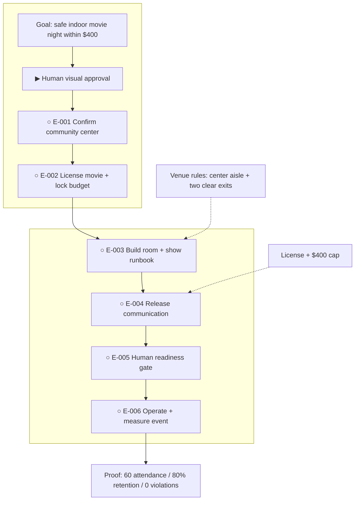

# Riverside Community Movie Night

**Status:** awaiting approval

**Destination:** A free indoor family movie night for about 80 neighbors at Riverside Community Center on September 12, 2026, from 7:00–10:00 PM.

**Success:** At least 60 attend, at least 80% stay through the credits, no safety or venue-rule violations occur, total spend is at or below $400, and the room is handed back clean.

**Now:** Planning is complete; no execution is authorized while the visual plan awaits Drew's approval.

**Next:** Drew approves this route or names one concrete revision.

**Text route:** Goal → ▶ Drew approves the finished plan → ○ confirm Riverside Community Center → ○ license a family movie and lock the budget → ○ build the indoor room and show runbook → ○ release accurate attendee communication → ○ pass the human readiness gate → ○ operate, clean up, and measure the event → prove attendance, retention, safety, compliance, and spend.

## Step details

Human visual approval — current gate

- Outcome: Drew accepts the finished indoor route or identifies one required revision.
- Owner: Human.
- Inputs: This view, the [short plan](PLAN.md), and the linked execution tickets.
- Proof: An explicit approval in conversation; silence or navigation to a file is not approval.
- If blocked or changed: Return the lifecycle to `planning`, revise the affected canonical artifacts, and present the updated visual again.

E-001 — Confirm Riverside Community Center

- Outcome: Written confirmation of the free room, date/time, capacity, built-in AV, accessibility, access window, cleanup, contact, aisle, and exit rules.
- Owner: Agent coordination with the venue manager; human reviews any new term.
- Inputs: [Venue decision and evidence](execution/E-001-confirm-indoor-venue.md).
- Proof: A dated, complete reservation record.
- If blocked or changed: Return to planning for unavailability, a fee, capacity below 80, inaccessible facilities, or a conflicting rule.

E-002 — License the movie and lock the budget

- Outcome: A family-appropriate movie is licensed for public showing and all planned costs total no more than $400.
- Owner: Agent researches and coordinates; Drew approves the title and payment.
- Inputs: The confirmed venue and [ticket scope](execution/E-002-license-movie-and-budget.md).
- Proof: Direct authorization, title/runtime, and a recalculated line-item budget.
- If blocked or changed: Try another suitable title; return to planning if no compliant title fits the complete budget.

E-003 — Build the room and show operations package

- Outcome: One runbook covers safe seating, accessible flow, built-in AV, staffing, check-in, show control, cleanup, and measurement.
- Owner: Agent prepares and verifies it with the venue manager and human event lead.
- Inputs: Confirmed venue, license, budget, and [operations ticket](execution/E-003-build-operations-package.md).
- Proof: Venue-confirmed layout, passed AV test, named roles, timed run-of-show, cleanup list, and measurement form.
- If blocked or changed: Return to planning if safe target seating or adequate built-in AV cannot fit the rules and budget.

E-004 — Release attendee communication

- Outcome: Accurate launch and reminder messages are sent and responses are tracked toward 60 attendees.
- Owner: Agent prepares and schedules; the human event lead approves and sends.
- Inputs: Licensed title, confirmed venue, completed runbook, and [communication ticket](execution/E-004-release-attendee-communication.md).
- Proof: Approved copy, send records, response tracker, and current projected-attendance count.
- If blocked or changed: Use additional available neighborhood channels; return to planning if 60 cannot be reached without changing scope or budget.

E-005 — Pass the readiness gate

- Outcome: A human go/no-go record confirms authorization, safety, staffing, AV, communication, and budget readiness.
- Owner: Agent assembles evidence; human event lead decides.
- Inputs: Completed E-001 through E-004 and the [readiness ticket](execution/E-005-pass-readiness-gate.md).
- Proof: A dated checklist and explicit go decision with no unresolved blocker.
- If blocked or changed: Return each failed check to its owner; return to planning for a material route, venue, or budget change.

E-006 — Operate, close, and measure the event

- Outcome: The human event team safely completes the movie night, cleans the room, and records every success measure.
- Owner: Human event team; agent may coordinate the runbook and consolidate records.
- Inputs: Passed readiness gate, approved runbook, and [event ticket](execution/E-006-operate-and-measure-event.md).
- Proof: Attendance, credits-retention percentage, incident/rule record, final spend, cleanup handback, and outcome summary.
- If blocked or changed: Follow the stop procedure for live safety, authorization, capacity, or AV failures and record the actual result.

## Plan-wide safety

- Do not begin execution before Drew explicitly approves this visual plan.
- Keep the marked center aisle and both exits unobstructed; never exceed the posted capacity of 100.
- Secure public-performance rights before announcing the movie.
- Keep total committed and actual spend at or below $400.
- Keep admission free with no food sales or fundraising.
- Use the built-in AV; a failed direct test returns the plan for revision before any rental or purchase.

Details: [plan](PLAN.md) · [venue decision](decisions/P-002-assess-riverside-feasibility.md)
