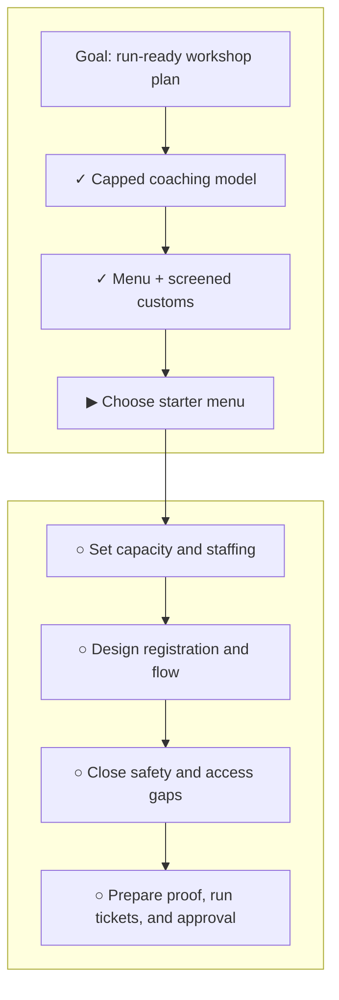

# Saturday Digital Confidence Workshop

**Status:** planning

**Destination:** An approved, run-ready plan for a free two-hour Saturday library workshop where adults safely learn to complete one everyday digital task on their own.

**Success:** Every confirmed participant safely repeats their chosen task on their own device without step-by-step prompting, or receives the pre-agreed contingency outcome.

**Now:** Capped coaching and a short supported menu with screened custom requests are confirmed; the menu's task families are still open.

**Next:** Choose the starter menu so capacity and helper coverage can be fixed.

**Text route:** Goal → capped coaching model ✓ → menu plus screened custom requests ✓ → choose starter menu ▶ → capacity and staffing → registration and flow → safety, accessibility, and contingencies → proof, run tickets, and approval

## Step details

✓ Capped coaching model

- Outcome: Advance registration, task screening, and individual coaching are required.
- Owner: Human decision, recorded by the planning agent.
- Inputs: [Current decision](decisions/P-001-define-workshop.md)
- Proof: The full selection, rationale, tradeoff, and immediate effects are saved.
- If blocked or changed: Reopen task scope, capacity, staffing, registration, flow, and proof together.

✓ Set accepted task scope

- Outcome: The workshop advertises a short supported menu and accepts custom requests only after advance screening.
- Owner: Human direction, with an agent recommendation.
- Inputs: The participant-choice promise and the confirmed capped model.
- Proof: A custom request is confirmed only when staff can prepare for it, coach it safely on the participant's own device, and preserve time for an independent repeat.
- If blocked or changed: Reopen the starter menu, capacity, staffing, registration, and flow together.

▶ Choose starter menu

- Outcome: A short, concrete list of task families tells participants what the first workshop is prepared to support.
- Owner: Human direction, with an agent recommendation.
- Inputs: The confirmed menu-plus-screened-customs model and workshop safety rules.
- Proof: Registrants can recognize their task, and helpers can prepare without turning the workshop into an open-ended tech clinic.
- If blocked or changed: Keep capacity and staffing open until the menu is settled.

○ Set capacity and staffing

- Outcome: Attendance cap, helper coverage, roles, and escalation points fit the accepted tasks.
- Owner: Planning agent, using confirmed library constraints; human only where authority or preference is required.
- Inputs: Supported menu, screened-custom rule, room, Wi-Fi, and available people.
- Proof: Every participant can receive coaching and complete an independent repeat within two hours.
- If blocked or changed: Reduce task breadth or attendance before weakening the participant promise.

○ Design registration and flow

- Outcome: Registration, screening, confirmation, waitlist, arrival, coaching, and wrap-up form one workable route.
- Owner: Planning agent.
- Inputs: Task scope, capacity, helper coverage, and accommodation needs.
- Proof: Each participant and helper knows what happens before, during, and after the workshop.
- If blocked or changed: Return to the earliest affected capacity or task-scope assumption.

○ Close safety and access gaps

- Outcome: Privacy, security, accessibility, no-show, device, Wi-Fi, and unsupported-task contingencies are explicit.
- Owner: Shared: agent drafts; library authority confirms local constraints.
- Inputs: Registration and room flow.
- Proof: No foreseeable issue forces staff to take control of a participant's sensitive task or improvise an unsafe workaround.
- If blocked or changed: Narrow the task boundary or add a documented contingency.

○ Prepare proof, run tickets, and approval

- Outcome: Session-sized run preparation covers the complete route and the finished plan is ready for human review.
- Owner: Planning agent prepares; human explicitly approves.
- Inputs: All confirmed workshop decisions and constraints.
- Proof: The finish audit passes, execution tickets agree with the plan, and approval remains pending until explicitly given.
- If blocked or changed: Return to the incomplete planning step; do not authorize the workshop.

## Plan-wide safety

- Participants keep control of their devices, accounts, passwords, and decisions.
- Staff do not perform sensitive transactions or impersonate participants.
- Unsupported or unsafe requests are redirected before the event where possible.
- Accessibility needs are collected before confirming the delivery setup.
- Capacity is reduced before the independent-completion promise is weakened.
- Planning does not authorize or run the workshop.

Details: [plan](PLAN.md) · [current decision](decisions/P-001-define-workshop.md)
