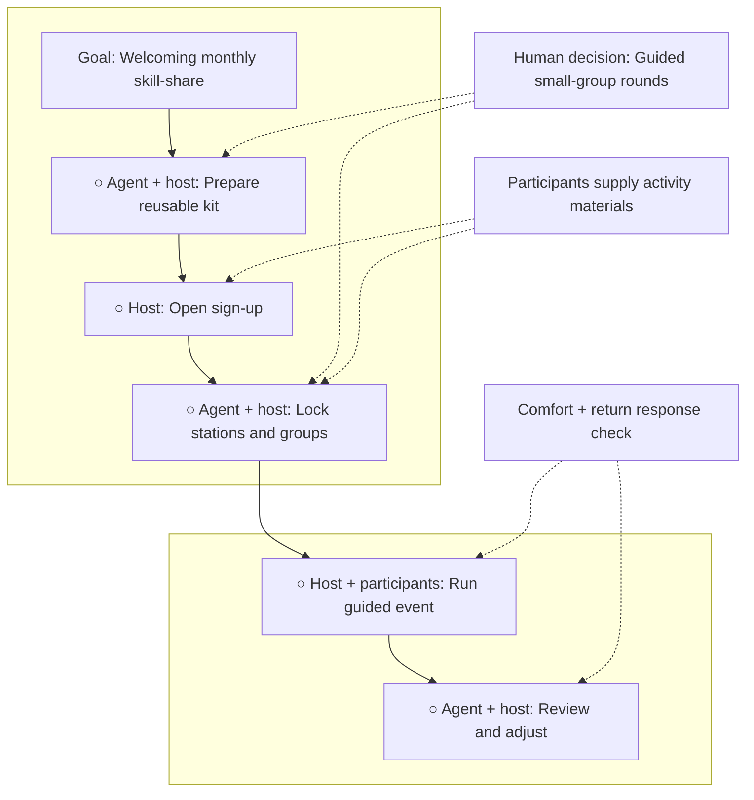

# Neighborhood Skill-Share Night

**Status:** awaiting approval

**Destination:** Run a repeatable, free monthly 90-minute library skill-share where about 20 adults teach practical skills in welcoming small groups.

**Success:** At least 70% of responding first-time attendees felt comfortable joining in, and at least half of all respondents would return.

**Now:** The guided-round plan is complete and ready for Drew's review; building and event work are not authorized.

**Next:** Drew approves the plan or names one change.

**Text route:** Goal → Prepare reusable kit → Open sign-up → Lock three stations and learner groups → Run the guided 90-minute event → Review comfort and return results → Repeat next month or return to planning

## Step details

E-001 — Prepare the reusable event kit

- Outcome: A complete repeatable host kit contains the agenda, invitation, roles, teacher prompt, group sheet, arrival prompt, reset checklist, and response check.
- Owner: Agent prepares; human host approves.
- Inputs: [Confirmed participation experience](decisions/P-001-define-participation-experience.md)
- Proof: Every required item exists with no unresolved placeholder and preserves the no-budget boundaries.
- If blocked or changed: Simplify the kit; return to planning only if the format cannot fit 90 minutes or requires organizer spending.

E-002 — Open the next event sign-up

- Outcome: The invitation is published and one roster is receiving learner and volunteer-teacher responses.
- Owner: Human host, with agent support.
- Inputs: Approved reusable kit, confirmed date, and library room rules.
- Proof: The live invitation states the practical purpose, date, place, duration, roles, materials, no-cost promise, and response cutoff.
- If blocked or changed: Stop for a room-rule conflict; use the existing free channels again if responses are low.

E-003 — Lock stations and group routes

- Outcome: Three compatible teachers and three balanced learner routes are ready.
- Owner: Agent prepares; human host and teachers confirm.
- Inputs: Reusable kit, completed roster, library rules, and material needs.
- Proof: The final run sheet names three 20-minute outcomes and sends every learner through all three stations.
- If blocked or changed: Repeat targeted teacher recruitment or move the date; never fill missing time with networking.

E-004 — Run the guided skill-share

- Outcome: The host completes the paired welcome, three skill rounds, response check, and room reset in 90 minutes.
- Owner: Human host, volunteer teachers, and participants.
- Inputs: Final run sheet, group routes, teacher materials, and response check.
- Proof: Actual timing, attendance, deviations, first-time comfort, and return intent are recorded; the room is reset.
- If blocked or changed: Protect attendee comfort and library rules, record deviations, and carry them to review.

E-005 — Review results and prepare the next month

- Outcome: Both success measures are calculated and one keep-or-adjust decision is ready for the next cycle.
- Owner: Agent calculates; human host approves the adjustment.
- Inputs: Attendance, responses, actual timing, and event deviations.
- Proof: The review records both numerators and denominators, threshold results, one adjustment, and the next action.
- If blocked or changed: Return to planning after two consecutive misses or before changing the guided participation format.

## Plan-wide safety

- Keep the event free, in the library room, near 20 adults, and exactly 90 minutes.
- Teachers and participants bring every activity material they need.
- Never force a newcomer to teach, address the room, or initiate an unstructured conversation.
- Give every attendee an arrival instruction, small group, assigned first station, and pass option.
- Keep activities practical and non-promotional; do not add generic networking.
- Treat missing first-time feedback as unproven comfort, not a passing result.

Details: [plan](PLAN.md) · [confirmed participation decision](decisions/P-001-define-participation-experience.md)
