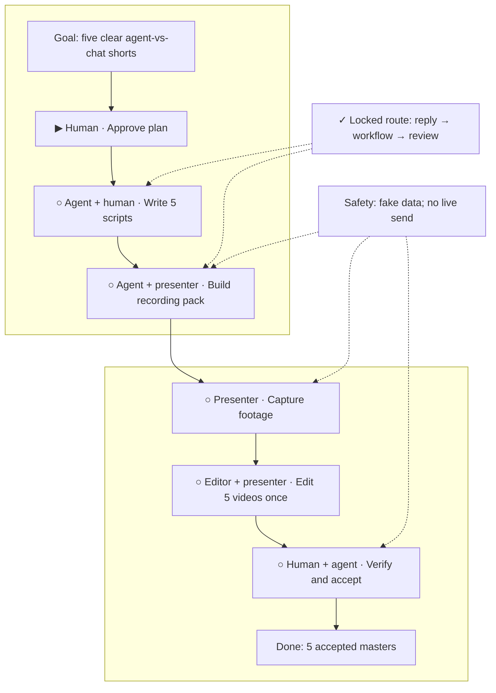

# Chat to Action

**Status:** awaiting approval

**Destination:** Five export-ready vertical shorts that teach small-business owners the difference between browser chat and a reviewed agent workflow.

**Success:** Five playable 9:16 exports under 60 seconds pass the content, safety, and final comprehension checks in `PLAN.md`.

**Now:** Planning is complete; build remains blocked pending explicit human approval of this visual.

**Next:** Approve the plan or request a specific change. Do not start E-001 before approval.

**Text route:** Goal → human approval → E-001 write five scripts → E-002 build the recording pack → E-003 capture presenter and screen footage → E-004 edit all five in one session → E-005 verify and accept → five final masters.

## Step details

Approval gate — Human final review

- Outcome: The finished plan is explicitly approved or returned with one specific change.
- Owner: Human
- Inputs: [plan](PLAN.md), this visual, and [locked series route](decisions/P-001-lock-series-route.md)
- Proof: An explicit approval is recorded before any execution ticket starts.
- If blocked or changed: Keep status `awaiting approval`; update canonical planning state before showing the visual again.

E-001 — Write the five scripts

- Outcome: Five timed scripts with spoken copy, on-screen copy, visual cues, and checked claims.
- Owner: Agent, with presenter review
- Inputs: [P-001](decisions/P-001-lock-series-route.md) and [evidence](evidence/P-001-evidence.md)
- Proof: Exactly five scripts each time below 55 seconds in read-aloud testing and collectively cover all success elements.
- If blocked or changed: Simplify wording; return to P-001 if the confirmed episode job or factual route must change.

E-002 — Build the recording pack

- Outcome: A rehearsed shot, overlay, fabricated-demo, and capture package for all five videos.
- Owner: Agent and presenter
- Inputs: Approved E-001 scripts and [P-001](decisions/P-001-lock-series-route.md)
- Proof: A dry run completes with no unresolved shot, asset, timing, access, or equipment dependency.
- If blocked or changed: Return to E-001 for bounded simplification or P-001 if a new resource is required.

E-003 — Capture the footage

- Outcome: Selected, organized presenter and fabricated-data screen takes for every planned shot.
- Owner: Presenter, with agent assistance
- Inputs: E-001 scripts and E-002 recording pack
- Proof: Every required take opens, matches the manifest, passes capture checks, and exposes no sensitive data.
- If blocked or changed: Recapture the defect; return to E-002 for an unreadable prepared shot.

E-004 — Edit the five videos

- Outcome: Five captioned 9:16 review exports produced in one editing session.
- Owner: Editor or editing agent, with presenter review
- Inputs: Approved scripts, overlay manifest, and selected E-003 footage
- Proof: Five ordered exports play, measure below 60 seconds, and pass caption, audio, and phone-legibility checks.
- If blocked or changed: Fix bounded edit defects, request only required pickups, or return to planning for a teaching-beat change.

E-005 — Verify and accept the exports

- Outcome: Exactly five accepted masters and a complete acceptance record.
- Owner: Agent and human owner
- Inputs: E-004 exports, [PLAN.md](PLAN.md), [P-001](decisions/P-001-lock-series-route.md), and [evidence](evidence/P-001-evidence.md)
- Proof: Every file passes technical/content/safety checks and the reviewer answers the three comprehension prompts using only the videos.
- If blocked or changed: Return to the exact failed predecessor; never waive a failed acceptance check.

## Plan-wide safety

- Explicit human approval is required before E-001 starts.
- Use fabricated business and customer data only.
- Never connect to or send from a live business system.
- Keep each video below 60 seconds and the complete set to five.
- Do not imply agents are flawless, always preferable, or safe without oversight.
- A route or claim change returns to P-001; defects return only to the relevant predecessor.

Details: [plan](PLAN.md) · [current decision](decisions/P-001-lock-series-route.md)
