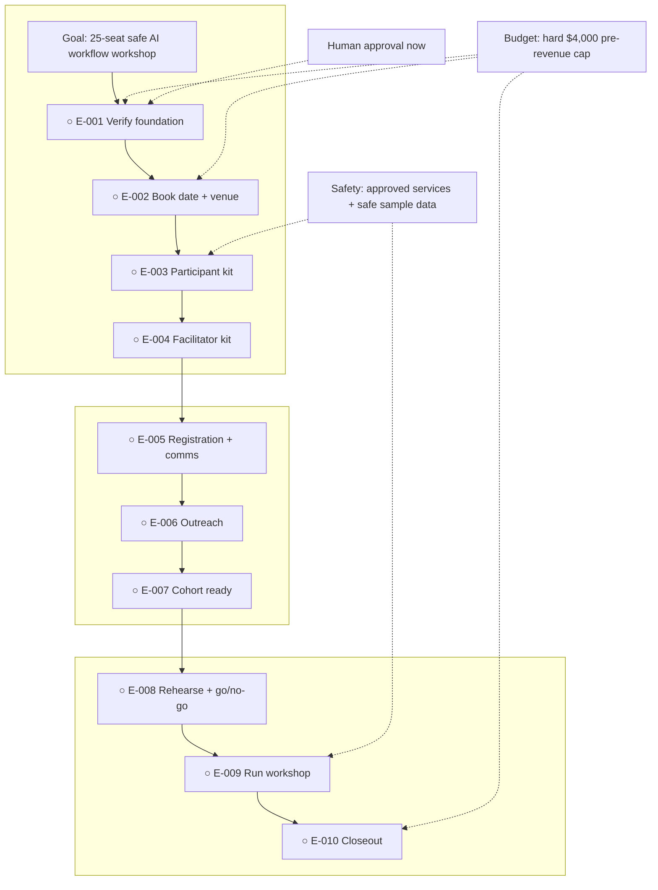

# One-Day AI Workflow Workshop

**Status:** awaiting approval

**Destination:** Run one local Saturday workshop within eight weeks where up to 25 small-business owners each complete a reviewed, repeatable, data-safe AI-assisted workflow.

**Success:** Cash commitments are no more than $4,000 before revenue; at least 18 people are confirmed at go/no-go; every attendee present passes the workflow review; attendance, completion, incidents, feedback, and expenses are recorded.

**Now:** Planning is complete with no planning blocker; project execution is not authorized.

**Next:** A human explicitly approves this visual plan or requests a specific change.

**Text route:** Goal → E-001 verify event foundation → E-002 book date and venue → E-003 build participant workflow kit → E-004 build facilitator delivery kit → E-005 configure registration and communications → E-006 launch outreach → E-007 prepare confirmed cohort → E-008 rehearse and issue go/no-go → E-009 operate workshop → E-010 close out and report.

## Step details

Approval gate — current

- Outcome: The completed plan is explicitly approved or returned with a specific change.
- Owner: Human.
- Inputs: [Plan](PLAN.md), this view, and [P-001 operating model](decisions/P-001-workshop-operating-model.md).
- Proof: An explicit approval statement or a concrete change request.
- If blocked or changed: Keep status `awaiting approval`; revise canonical state and regenerate this view. Do not start E-001.

E-001 — Verify event foundation

- Outcome: A direct-source date, venue, requirements, service, and quote dossier demonstrates a viable event inside the plan's gates.
- Owner: Agent, with human selection review.
- Inputs: P-001 venue, budget, timing, accessibility, and safety rules.
- Proof: Three comparable venue/date candidates, direct quote/requirement evidence, approved-service candidates, and a balanced provisional ledger at or below $4,000.
- If blocked or changed: Return to planning if no candidate can satisfy date, capacity, accessibility, safety, or budget; E-002 stays ineligible.

E-002 — Book date and venue

- Outcome: One qualifying Saturday and venue are confirmed in writing and entered in the controlled budget.
- Owner: Shared; agent prepares and records, human approves spending and contract terms.
- Inputs: Approved E-001 dossier and P-001 spending rules.
- Proof: Dated booking/hold, written inclusions and cancellation terms, connectivity-test appointment, and updated ledger no greater than $4,000.
- If blocked or changed: Do not spend or advance; return to E-001 or planning. E-003 stays ineligible.

E-003 — Build participant workflow kit

- Outcome: A beginner can choose, build, test twice, review, and retain one safe workflow using the participant kit.
- Owner: Agent, with human content review.
- Inputs: P-001 result standard, safety rules, approved services, venue capabilities.
- Proof: Workbook, workflow card, synthetic sample pack, review rubric, safety card, prerequisites, and a clean-device walkthrough pass.
- If blocked or changed: Correct the kit or return to planning if the result cannot be achieved safely; E-004 stays ineligible.

E-004 — Build facilitator delivery kit

- Outcome: Drew and two helpers can run the agenda, beginner lanes, reviews, fallbacks, and incident response consistently.
- Owner: Agent, with all three staff reviewing roles.
- Inputs: Participant kit, agenda, venue, safety and review standard.
- Proof: Minute-by-minute run sheet, role cards, clinic roster, setup/teardown lists, incident procedure, and timed tabletop pass.
- If blocked or changed: Revise until all responsibilities and fallbacks have owners; E-005 stays ineligible.

E-005 — Configure registration and communications

- Outcome: A reviewed registration path can sell 20 standard seats, award five scholarships, manage the waitlist, and collect only necessary readiness information.
- Owner: Agent configures; human approves public copy and publication.
- Inputs: Confirmed date/venue, participant prerequisites, pricing/refund policy, safety notice.
- Proof: End-to-end test registration, capacity controls, scholarship/waitlist flows, receipts, scheduled reminders, and privacy/data-minimization check.
- If blocked or changed: Do not publish; repair or return to planning. E-006 stays ineligible.

E-006 — Launch outreach

- Outcome: Approved local outreach is live with source-tagged registration tracking and no unsupported claims.
- Owner: Shared; agent prepares and tracks, human approves recipients and sends/publication.
- Inputs: Live registration, audience definition, scholarship allocation, confirmed event facts.
- Proof: Published event listing, partner/direct outreach log, tagged registration sources, and scheduled checkpoints.
- If blocked or changed: Stop unapproved messages and correct claims or permissions; E-007 stays ineligible until a valid launch exists.

E-007 — Prepare the confirmed cohort

- Outcome: The T-14 cohort is reconciled and prepared; if it is below 18, the fixed five-day recovery outreach is launched for final recheck at T-7.
- Owner: Agent coordinates; attendees respond; human handles accommodations and exceptions.
- Inputs: Registration roster, prerequisites, intake responses, participant kit, venue constraints.
- Proof: Data-minimized roster, readiness status, accommodation plan, workflow starting points, waitlist actions, dated count, and—when below 18—a launched five-day recovery record.
- If blocked or changed: Do not complete the ticket if records, safe access, or accommodations cannot be routed. A below-18 count may advance only with the defined recovery launched; E-008 owns the final recheck and remains a hard gate.

E-008 — Rehearse and issue go/no-go

- Outcome: At T-7, the full path is rehearsed and every venue, internet fallback, staffing, service, safety, material, and cohort gate has a named pass.
- Owner: Shared; Drew owns the go/no-go decision.
- Inputs: Completed E-001 through E-007 artifacts and current budget.
- Proof: Timed rehearsal record, on-site connectivity test, packed materials inventory, three-person staffing confirmation, gate checklist, and signed go/no-go.
- If blocked or changed: No event delivery while a required gate is false; pause commitments and return to the owning ticket or planning. E-009 stays ineligible.

E-009 — Operate the workshop

- Outcome: The workshop runs 9:00–4:30 and every attendee present leaves with a passed, repeatable workflow card.
- Owner: Drew and two helpers; agent may support records and checklists.
- Inputs: Go decision, delivery kit, participant kit, roster, venue, incident procedure.
- Proof: Attendance record, one passed checklist per attendee, anonymized completion total, incident log, feedback, and same-day expense updates.
- If blocked or changed: Follow safety and emergency procedures; never waive a failed review or use confidential data to preserve completion. E-010 waits for actual event records.

E-010 — Close out and report

- Outcome: Attendees receive their materials and the organizer has a reconciled outcome, safety, feedback, and budget report.
- Owner: Agent prepares and sends after human review; human approves sensitive follow-up and financial reconciliation.
- Inputs: Workshop evidence, registration/payment records, expenses, feedback.
- Proof: Follow-up sent within two business days, final ledger, outcome dashboard, incident resolution record, and improvement log.
- If blocked or changed: Keep the project open until material discrepancies or incidents are resolved; return plan-changing lessons to planning rather than rewriting the approved decision.

## Plan-wide safety

- Do not execute until a human explicitly approves this visual plan.
- Never exceed $4,000 in pre-revenue cash commitments without returning to planning.
- Use only organizer-approved services and synthetic, redacted, or public workshop data.
- Keep every downstream ticket ineligible while its dependency is incomplete or blocked.
- Do not run the event without the T-7 venue, fallback, staffing, service, safety, material, and cohort gates.
- Record evidence without retaining confidential attendee or customer data.

Details: [plan](PLAN.md) · [confirmed decision](decisions/P-001-workshop-operating-model.md)
