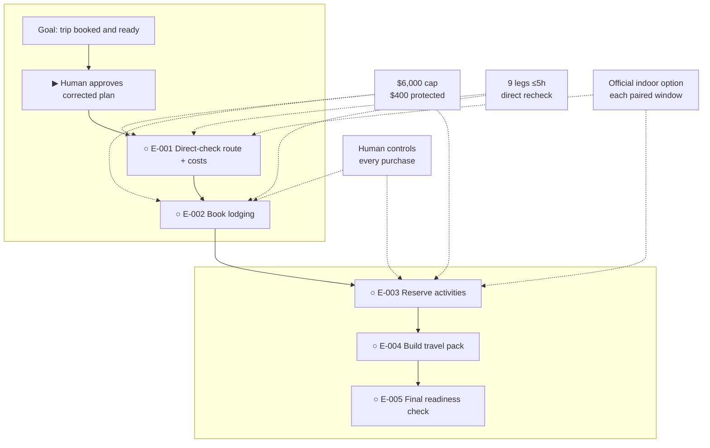

# 14-Day Fall Family Road Trip

**Status:** awaiting approval

**Destination:** A 14-day, 13-night Dallas family loop through Texarkana, Arkansas, Tennessee, and Mammoth Cave, booked and ready to travel October 10–23, 2026.

**Success:** All 14 days and 13 nights are confirmed; all nine exact lodging-to-lodging legs verify at ≤5 hours with a direct mapping provider, each paired two-day window has an official-provider indoor option, qualifying private-bath lodging is used, and the final total is ≤$6,000 including $400 contingency.

**Now:** The source-quality correction and route repair are complete; no execution is authorized.

**Next:** Human reviews this corrected finished route and explicitly approves it or requests changes.

**Text route:** Goal: trip booked and ready → Human explicitly approves the corrected plan → E-001 verify all nine exact routes, lodging inventory, official attraction schedules, and costs without purchasing → E-002 recheck direct providers and secure 13 refundable lodging nights with human-controlled payment → E-003 recheck official ticket providers and reserve the family cave tour plus any necessary timed indoor entries → E-004 assemble and review the 14-day offline travel pack → E-005 run the 72-hour weather, road, reservation, vehicle, and go/no-go check.

**Trip route:** Dallas → Texarkana (1 night) → Hot Springs (2) → Memphis (2) → Nashville (3) → Mammoth Cave area (2) → Jackson (1) → Little Rock (1) → Texarkana (1) → Dallas. Direct city-center baselines: 3h05, 2h02, 3h24, 3h56, 1h50, 4h08, 4h04, 2h35, and 3h06. E-001 must replace these with exact lodging-to-lodging direct-provider checks; E-002 repeats adjacent checks before lodging charges.

## Step details

Human approval — review the corrected finished plan

- Outcome: The human explicitly approves the visible corrected plan or names a required change.
- Owner: human
- Inputs: This view and the linked [plan](PLAN.md)
- Proof: An explicit approval or change request is recorded; silence is not approval.
- If blocked or changed: Keep status `awaiting approval`; revise canonical planning state before showing the plan again.

E-001 — Verify live route and costs

- Outcome: A purchase-free booking sheet proves live feasibility from direct route providers and official operators.
- Owner: agent, followed by human review
- Inputs: [Trip blueprint](decisions/P-001-trip-blueprint.md) and corrected [evidence](evidence/P-001-evidence.md)
- Proof: Nine exact legs ≤5h, all 13 nights covered by qualifying candidates, all seven paired indoor windows verified, a suitable October 18/19 cave tour identified, and projected total ≤$6,000 with $400 contingency.
- If blocked or changed: Return to planning for any failed direct route, lodging, cave/fallback, or total-budget constraint.

E-002 — Secure refundable lodging

- Outcome: Eight reservations cover all 13 nights within the $2,600 lodging cap.
- Owner: shared; agent prepares and records, human controls payment
- Inputs: Approved E-001 booking sheet
- Proof: Direct-provider route rechecks and confirmations match dates, occupancy for four, private bathrooms, cancellation terms, and cap.
- If blocked or changed: Stop before purchase; return to E-001 or planning under the ticket rules.

E-003 — Reserve dated activities

- Outcome: A family-suitable Mammoth Cave tour and necessary timed indoor entries are confirmed.
- Owner: shared; human controls payment
- Inputs: Lodging confirmations and direct official attraction/ticket providers
- Proof: Reservations match ages/dates, all seven paired indoor windows remain covered, activities ≤$650, and whole trip ≤$6,000.
- If blocked or changed: Try another suitable October 18/19 tour; return to planning if the cave or fallback cadence cannot be preserved.

E-004 — Assemble the travel pack

- Outcome: One reviewed, offline-usable 14-day itinerary contains routes, stops, fallbacks, confirmations, packing, and budget.
- Owner: agent, followed by both adults' review
- Inputs: Completed E-001 through E-003 outputs
- Proof: Every day, reservation, direct-verified route, required break, paired indoor window, and category total reconciles.
- If blocked or changed: Fix clerical issues; return to prior execution or planning for a substantive constraint failure.

E-005 — Final readiness check

- Outcome: Within 72 hours of departure, the family records a safe go/no-go decision.
- Owner: shared; both adults own the decision
- Inputs: Reviewed travel pack, live alerts/forecasts, confirmations, direct route checks, family and vehicle readiness
- Proof: Timestamped checklist, offline materials, valid reservations, unchanged caps, and both adults' explicit decision.
- If blocked or changed: Use approved same-city fallbacks for ordinary rain; pause and return to planning for severe or constraint-breaking changes.

## Plan-wide safety

- No normal driving leg may exceed five hours; use direct providers before booking and add a break at least every 2.5 hours.
- Keep total committed and planned spend at or below $6,000; protect $400 contingency.
- Use lodging legal for four with a private bathroom; prefer refundable terms.
- Preserve an official-provider indoor option in each paired two-day window.
- A human approves every charge; never store full payment-card data.
- Severe weather, route closure, lodging failure, or a broken core cap pauses execution and returns the plan for review.

Details: [plan](PLAN.md) · [confirmed blueprint](decisions/P-001-trip-blueprint.md)
