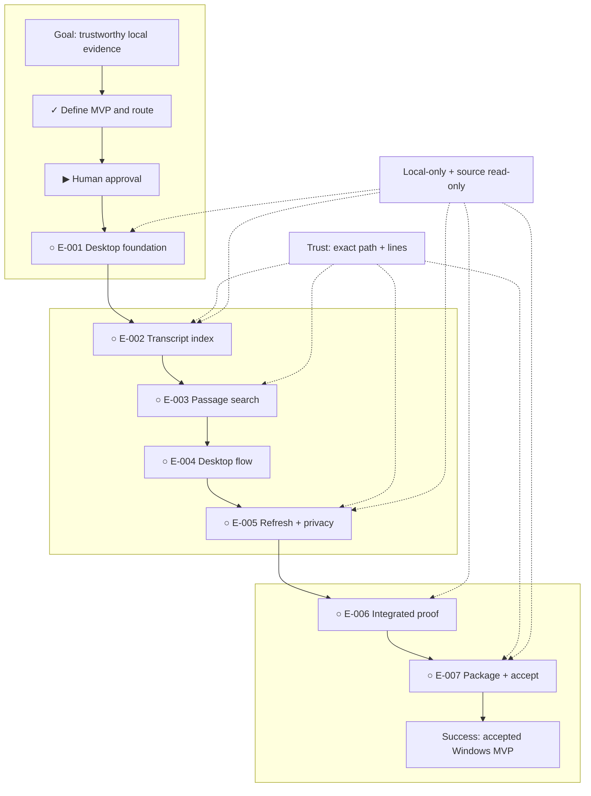

# Local Interview Evidence Library

**Status:** awaiting approval

**Destination:** An installable Windows 11 desktop app that turns one local transcript folder into a private library of source-verifiable passages.

**Success:** A nontechnical user indexes up to 500 `.txt`/`.md` transcripts, gets a known result in under one second after indexing, verifies exact filename and lines, refreshes changes, and completes the offline path without a terminal.

**Now:** Planning is complete and no build work is authorized; the finished route is waiting for explicit human review.

**Next:** Approve this visual plan or request a specific change.

**Text route:** Goal → ✓ define MVP and build route → ▶ explicit human approval → ○ E-001 desktop foundation → ○ E-002 transcript index → ○ E-003 trustworthy passage search → ○ E-004 complete desktop flow → ○ E-005 durable refresh and privacy → ○ E-006 integrated proof → ○ E-007 package and human acceptance → accepted Windows 11 MVP

**Connections:** Exact path-and-line trust constrains indexing, search, and refresh. Local-only and source-read-only behavior constrain the foundation, indexing, refresh/privacy, and final acceptance. Every execution step depends on the preceding step; none is eligible before approval.

## Step details

▶ Human approval

- Outcome: The finished visual is explicitly approved or returned with a concrete change request.
- Owner: Human
- Inputs: [plan](PLAN.md), this complete visual, and [resolved MVP decision](decisions/P-001-define-mvp-and-build-route.md)
- Proof: An explicit approval message; silence or file generation is not approval.
- If blocked or changed: Keep status `awaiting approval`; revise canonical planning state before asking again.

✓ P-001 — Define the MVP and build route

- Outcome: Platform, workflow, inputs, trust, privacy, architecture, acceptance, exclusions, and execution order are settled.
- Owner: Shared — one simulated human platform preference; agent synthesis/research for mechanics
- Inputs: `IDEA.md`, `TEST-PROFILE.md`, and [primary-source evidence](evidence/P-001-evidence.md)
- Proof: [P-001 completion check](decisions/P-001-define-mvp-and-build-route.md) passes and all canonical files agree.
- If blocked or changed: Reopen P-001, reconcile downstream tickets, and keep execution unauthorized.

○ E-001 — Establish the desktop foundation

- Outcome: A Windows-targeted Tauri shell opens and a migrated bundled SQLite database passes an FTS5 smoke test.
- Owner: Agent
- Inputs: [E-001 ticket](execution/E-001-establish-desktop-foundation.md) and P-001
- Proof: Migration/reopen/FTS tests, Windows launch evidence, and a capability/dependency audit pass.
- If blocked or changed: Return to planning for an invalid shell, bundled-FTS, or permission assumption; E-002 stays blocked.

○ E-002 — Build the transcript index

- Outcome: Supported transcripts become exact line-addressed passages and FTS rows without source writes.
- Owner: Agent
- Inputs: [E-002 ticket](execution/E-002-build-transcript-index.md) and the proven E-001 database
- Proof: Parser edge cases, 500-file cap, transaction rollback, and byte/timestamp immutability tests pass.
- If blocked or changed: Return to planning for unstable provenance, unenforceable scale, or any source write; E-003 stays blocked.

○ E-003 — Build trustworthy passage search

- Outcome: Safe term and phrase queries return deterministic exact passages, provenance, context, and copy payloads.
- Owner: Agent
- Inputs: [E-003 ticket](execution/E-003-build-trustworthy-passage-search.md) and the proven index
- Proof: Ranking, adversarial query, provenance, empty/error, and copy round-trip tests pass.
- If blocked or changed: Return to planning if safe local FTS cannot meet the trust contract; E-004 stays blocked.

○ E-004 — Deliver the complete desktop flow

- Outcome: Folder choice through citation copy works in one accessible desktop path without a terminal.
- Owner: Shared — agent implementation, human keyboard/workflow review
- Inputs: [E-004 ticket](execution/E-004-deliver-complete-desktop-flow.md) and the proven search boundary
- Proof: Automated happy path, state/accessibility tests, and human Windows keyboard review pass.
- If blocked or changed: Correct UI defects here or return to planning for a new product/permission need; E-005 stays blocked.

○ E-005 — Make refresh and privacy behavior durable

- Outcome: Add/change/delete refresh, stale warnings, failed-refresh recovery, and Forget library preserve trust and source files.
- Owner: Shared — agent implementation, human warning/confirmation review
- Inputs: [E-005 ticket](execution/E-005-make-refresh-and-privacy-durable.md) and the working desktop flow
- Proof: Reconciliation, rollback, stale, restart, Forget, immutability, and no-network capability tests pass.
- If blocked or changed: Return to planning for any atomicity, staleness, locality, or immutability failure; E-006 stays blocked.

○ E-006 — Prove the integrated MVP

- Outcome: A deterministic 500-file corpus and automated report prove the integrated offline route, correctness, privacy, source immutability, and search speed.
- Owner: Agent
- Inputs: [E-006 ticket](execution/E-006-prove-integrated-mvp.md), all prior proof, and the deterministic acceptance corpus
- Proof: Clean-build full-system runner passes, known searches render in under one second, exact citations match sources, and all lower-level suites remain green.
- If blocked or changed: Return to the owning prior ticket or planning with the exact failed proof; E-007 stays blocked.

○ E-007 — Package and accept the Windows MVP

- Outcome: A reproducible installer passes clean-account offline installation, the preserved evidence workflow, uninstall checks, and explicit human acceptance.
- Owner: Shared — agent packaging/record, human final acceptance
- Inputs: [E-007 ticket](execution/E-007-package-and-accept-windows-mvp.md) and the passing E-006 corpus, runner, and report
- Proof: Clean install/launch/uninstall evidence, checksum, offline acceptance rerun, three manual source comparisons, source immutability, and explicit human acceptance all pass.
- If blocked or changed: Return to the owning E-* ticket or planning with exact reproduction; never waive a trust, privacy, platform, scale, speed, or installer condition.

## Plan-wide safety

- No E-* ticket starts before explicit approval, and no downstream ticket starts before its dependency passes.
- Transcript contents and indexes stay local; no network, telemetry, updater, remote asset, account, service, or model enters the MVP.
- Source folders are read-only; deleting local app data never deletes or edits transcripts.
- Evidence is exact stored text with relative filename and 1-based line range; changed/missing sources are visibly stale until refresh.
- Windows 11, `.txt`/`.md`, one folder, and 500 files are the MVP boundary; broader scope returns to planning.
- Failed atomic work preserves the previous valid index and blocks downstream progress rather than hiding the failure.

Details: [plan](PLAN.md) · [resolved decision](decisions/P-001-define-mvp-and-build-route.md)
