# Hanoi Picks

**Status:** live acceptance · `0/3` clean videos

**Destination:** Prove three consecutive real videos can reach Drew-approved Final Review through Asset's normal public flow, then hand routine operation to Asset without Codex repair.

**Success:** `3/3` consecutive clean videos; any shared repair resets the streak to zero.

**Now:** The pre-repair Script Review `dab582db94ac654f` on card `HPP-20260805-05` is invalid and outside the streak. Do not approve, retry, or count it.

**Next:** One explicit-fresh public Asset `/picks` turn must retire that review and deliver a complete current Script Review. That begins the next countable attempt.

```mermaid
%%{init: {"theme":"base","themeVariables":{"fontFamily":"Inter, ui-sans-serif, system-ui, sans-serif","background":"#FFFFFF","lineColor":"#98A2B3","clusterBkg":"#F8FAFC","clusterBorder":"#D0D5DD"}}}%%
flowchart TB
    subgraph R1["01 · START · Choose and approve the idea"]
    direction LR
    G["GOAL<br/>3 clean videos"] --> N(["NOW · Fresh public /picks"])
    N --> P1(["HUMAN · 1 Pick Desk<br/>Drew chooses"])
    P1 --> P2(["HUMAN · 2 Script Review<br/>Drew approves"])
    end

    subgraph R2["02 · MAKE · Build and refine the video"]
    direction LR
    P3["AUTO · 3 Narration + captions"] --> P4(["HUMAN · 4 Clip Desk<br/>Drew chooses clips"])
    P4 --> P5["AUTO · 5 Rough Cut"]
    P5 --> P6(["HUMAN · 6 Editor Review<br/>Drew approves"])
    end

    subgraph R3["03 · FINISH · Prove and approve the result"]
    direction LR
    P7(["HUMAN · 7 Music Review<br/>Drew approves"]) --> P8["AUTO · 8 Final QA"]
    P8 --> P9(["HUMAN · 9 Final Review<br/>Drew approves"])
    P9 --> D(["PROOF · Clean streak +1"])
    D --> P10(["HUMAN · 10 Schedule<br/>separate Confirm Post"])
    end

    P2 --> P3
    P6 --> P7

    X["INVALID · Old Script Review<br/>do not approve or count"] -.-> N

    subgraph SYS["SYSTEMS · Powering the route"]
    direction LR
    A["SUPPORT · Asset Eve<br/>operates start + reviews"]
    PR["SUPPORT · Pick Radar<br/>feeds step 1"]
    MR["SUPPORT · Meme Radar<br/>feeds step 2"]
    IH["SUPPORT · Intelligence history<br/>protects steps 1–2"]
    VF["SUPPORT · Video factory<br/>runs steps 3, 5, 8"]
    AP["SUPPORT · Auto Post<br/>runs steps 7 + 10"]
    A ~~~ PR ~~~ MR ~~~ IH ~~~ VF ~~~ AP
    end
    P10 ~~~ A

    classDef goal fill:#101828,stroke:#6172F3,color:#FFFFFF,stroke-width:2px,font-weight:700;
    classDef current fill:#6938EF,stroke:#D6BBFB,color:#FFFFFF,stroke-width:3px,font-weight:700;
    classDef human fill:#FFF4D6,stroke:#DC9B25,color:#5B3A00,stroke-width:2px,font-weight:600;
    classDef work fill:#EAF2FF,stroke:#528BCE,color:#12385B,stroke-width:2px;
    classDef proof fill:#E7F8EE,stroke:#32A467,color:#14532D,stroke-width:2px,font-weight:700;
    classDef support fill:#F2F4F7,stroke:#98A2B3,color:#344054,stroke-width:1px,stroke-dasharray:4 3;
    classDef blocked fill:#FFF0F0,stroke:#D92D20,color:#7A271A,stroke-width:2px;

    style R1 fill:#F8FAFC,stroke:#D0D5DD,stroke-width:1px,color:#344054
    style R2 fill:#F8FAFC,stroke:#D0D5DD,stroke-width:1px,color:#344054
    style R3 fill:#F8FAFC,stroke:#D0D5DD,stroke-width:1px,color:#344054
    style SYS fill:#FFFFFF,stroke:#D0D5DD,stroke-width:1px,color:#667085

    class G goal;
    class N current;
    class P1,P2,P4,P6,P7,P9,P10 human;
    class P3,P5,P8 work;
    class D proof;
    class A,PR,MR,IH,VF,AP support;
    class X blocked;
```

**Text route:** Fresh public `/picks` → Pick Desk → Script Review → automatic narration/captions → Clip Desk → Rough Cut → Editor Review → Music Review → Final QA → Final Review → record one clean run. Scheduling is separate: choose a Central time → prepare → later exact `Confirm Post`.

## Step details

Current gate — Start the next countable attempt

- Outcome: A fresh, fully delivered Script Review starts after the latest shared repair.
- Owner: Drew initiates; Asset Eve performs one public `hanoi_flow` action.
- Inputs: Current invalid revision `dab582db94ac654f` and explicit-fresh `/picks` wording.
- Proof: The invalid review is retired and the same turn delivers a new exact card plus complete Script Review.
- If blocked or changed: Preserve durable truth, report the exact terminal failure, repair only a shared cause, and reset the streak after any shared repair.

1 · Pick Desk

- Outcome: One current, verified, unused player-prop card is selected.
- Owner: Pick Radar gathers; Asset selects through the public flow; Drew may request a different fresh video.
- Inputs: Verified live inventory and deletion-independent card history.
- Proof: Exact event, player, market, book, side, line, and current evidence agree.
- If blocked or changed: Retire only an unshown stale candidate and continue through current inventory; never substitute after Script Review is shown.

2 · Script Review

- Outcome: A fact-safe narration package binds one verified current meme image, sound, trigger, timing, placement, and plain-English hook connection.
- Owner: Asset drafts; Drew approves or revises.
- Inputs: Locked card snapshot, approved Hanoi references, Meme Trend Radar, and intelligence history.
- Proof: Exact sports facts pass; the full script and coherent meme package are visibly delivered.
- If blocked or changed: Return changes to Script Review, preserve prior versions, and never begin paid narration before exact approval.

3 · Automatic narration + captions

- Outcome: ElevenLabs narration, exactly `+2.0 dB`, aligned transcript, and locked captions are ready for footage work.
- Owner: Video factory.
- Inputs: Exact approved Script revision.
- Proof: Playable narration/caption proof matches the approved words and revision.
- If blocked or changed: Resume from the saved checkpoint; a script change invalidates only dependent output.

4 · Clip Desk

- Outcome: A complete ordered and trimmed gameplay timeline is saved.
- Owner: Drew alone.
- Inputs: Four verified playable choices per pick and locked voice timing.
- Proof: Every subject has selected, ordered, playable trims and one saved complete timeline.
- If blocked or changed: Stay at Clip Desk; Asset never chooses or mutates trims.

5 · Rough Cut

- Outcome: The approved timeline and narration become the first complete MP4.
- Owner: Video factory.
- Inputs: Saved Clip Desk timeline and locked audio revision.
- Proof: A playable deterministic MP4 matches the selected trims and narration.
- If blocked or changed: Reuse the same idempotent render identity or return to the owning invalid input; do not duplicate work.

6 · Editor Review

- Outcome: Captions, cards, the exact Script Review meme, opening treatment, and approved graphics are baked into a reversible video version.
- Owner: Asset edits; Drew approves or revises.
- Inputs: Rough cut, caption plan, card images, bound meme assets, and matching Creative Playbook guidance.
- Proof: Playable video plus baked-frame checks preserve locked facts, media, readability, and layer order.
- If blocked or changed: Return the exact change to Editor, preserve prior versions, and never broaden one instruction into neighboring edits.

7 · Music Review

- Outcome: One sourced track is mixed beneath intelligible narration.
- Owner: Asset renders; Drew approves or revises.
- Inputs: Approved Editor version and saved sound library.
- Proof: Playable mix binds the exact source video, track, volume, and output hash.
- If blocked or changed: Preserve the approved Editor video and retry or revise only Music.

8 · Final QA

- Outcome: Strict baked-artifact checks prove the final media chain.
- Owner: Automatic by default; Drew alone may explicitly skip for the exact hash.
- Inputs: Approved Music mix and artifact manifests.
- Proof: QA passes, or an explicit skip is bound to the exact video hash.
- If blocked or changed: Return to the earliest disproven stage; never let a skip approve, schedule, or post.

9 · Final Review

- Outcome: Drew approves the exact hash-bound final MP4.
- Owner: Drew.
- Inputs: QA-passed or explicitly hash-skipped final artifact.
- Proof: Exact final approval is recorded; for acceptance, this advances the clean streak by one.
- If blocked or changed: Return to the owning stage and preserve the rejected final; final approval alone never posts.

10 · Schedule and Confirm Post

- Outcome: An approved final is posted only at the chosen Central time to TikTok account `48274`.
- Owner: Drew chooses time and later confirms; Auto Post performs the bound action.
- Inputs: Exact final artifact, platform/account, time, and single-use confirmation token.
- Proof: Prepare shows the bound artifact/account/time; a separate later exact `Confirm Post` consumes it.
- If blocked or changed: Stop before upload and prepare a fresh exact binding; Autopilot never confirms on Drew's behalf.

## Supporting systems

- **Asset Eve:** durable GPT-5.6-sol conversational operator with exactly one public `hanoi_flow` tool and no hidden coding or manual-state capability.
- **Pick Radar:** maintains verified, current, unused player-prop inventory.
- **Meme Trend Radar:** supplies current, source-backed, unused formats and exact native previews; one valid item is the current Script Review gate and six is the background reserve target.
- **Hanoi intelligence history:** prevents card and shown-meme reuse independently of deletable jobs.
- **Video factory:** owns durable queue, leases, checkpoints, retries, preparation, and renders.
- **Auto Post:** owns music/finalization support and the separate posting confirmation boundary.

## Plan-wide safety

- No paid narration before exact Script approval.
- Drew alone owns Clip Desk choices and trims.
- Every revision preserves the previous version and returns to its owning stage.
- Any shared repair invalidates the run and resets the clean streak.
- Final approval never posts.
- Posting requires a separate exact `Confirm Post` turn for TikTok account `48274`.

Details: [fixture authority](PLAN-SNAPSHOT.md)
