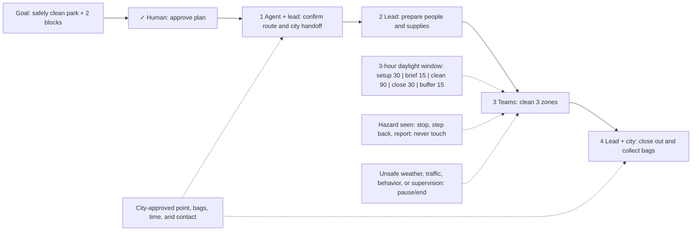

# One-Day Neighborhood Cleanup

**Destination:** Clean the park and two nearby public blocks in one day, with ordinary litter sealed for city collection and no volunteer handling hazardous waste.

**Success:** Every zone has a documented pass, all volunteers check out, hazards remain untouched and are reported, and counted sealed bags are accepted for city pickup.

**Now:** Planning is complete and ready for human review.

**Next:** Approve the plan or name one change before execution begins.

**Text route:** Goal → human approval → confirm route and city handoff → prepare people and supplies → clean the park and two blocks → account for everyone and confirm city collection

## Current step

- Outcome: Human accepts the complete plan or identifies a specific change.
- Owner: Human
- Inputs: [plan](PLAN.md), [safety and operating decision](decisions/P-001-safe-cleanup-operating-plan.md), and four linked execution tickets.
- Proof: Explicit approval covers the destination, safety boundary, city handoff, and execution order.
- If blocked or changed: Keep planning closed to execution, record the requested change in P-001, and regenerate the plan and this view.

## Plan-wide safety

- Volunteers never touch, move, bag, inspect, or identify suspected hazardous waste.
- On a hazard: stop nearby work, step back, record the location remotely, and report it.
- Use buddy pairs; every volunteer checks in and out.
- Stay on public ground and out of traffic lanes.
- Pause or end work when weather, traffic, behavior, or supervision becomes unsafe.
- Seal and stage bags only at the city-approved point; volunteers do not haul them away.

Details: [plan](PLAN.md) · [planning decision](decisions/P-001-safe-cleanup-operating-plan.md)
