# Shared project inbox

**Status:** awaiting approval

**Destination:** A phone-captured idea becomes a safe, findable inbox record that Drew can compare and explicitly select with any workspace agent.

**Success:** A live phone-to-fresh-agent pilot preserves exact originals among 20+ ideas, rejects unauthorized or failed saves honestly, and records only Drew's confirmed selection.

**Now:** HUMAN review of the completed plan; building is not authorized.

**Next:** Approve the route or name one change.

```mermaid
flowchart LR
    R(["NOW · HUMAN plan review"])
    P1["1 · Protect the inbox"]
    P2["2 · Capture from phone"]
    P3["3 · Find it later"]
    P4["4 · Compare three ideas"]
    P5(["5 · HUMAN confirms next"])
    D(["DONE · Live flow proven"])
    R --> P1 --> P2 --> P3 --> P4 --> P5 --> D

    classDef current stroke-width:3px,font-weight:700;
    classDef milestone stroke-width:2px;
    classDef human stroke-width:3px;
    classDef proof stroke-width:3px,font-weight:700;

    class R current;
    class P1,P2,P3,P4 milestone;
    class P5 human;
    class D proof;
```

**Text route:** Review and approve the plan → protect the existing Markdown inbox → capture text or links from a private phone chat → retrieve exact ideas in a fresh agent session → compare a three-idea shortlist → Drew confirms one idea → prove safety and the complete live flow.

## Step details

NOW · Human plan review

- Outcome: The destination, boundaries, route, and proof are explicitly accepted or revised.
- Owner: Drew.
- Inputs: [plan](PLAN.md) and [confirmed product contract](decisions/P-001-define-shared-inbox-contract.md).
- Proof: Drew explicitly approves this review.
- If blocked or changed: Reopen only the affected decision and reconcile downstream tickets.

1 · Protect the inbox

- Outcome: Safe, tested append and status updates preserve legacy `INBOX.md` content.
- Owner: Agent.
- Inputs: P-001, a copy of the current inbox, and its existing capture template.
- Proof: Success and forced-failure tests leave all unrelated content byte-for-byte intact.
- If blocked or changed: Stop before touching the real inbox and return with the exact incompatible structure.

2 · Capture from phone

- Outcome: Drew's private text or link becomes one stable inbox record and receives an honest acknowledgement.
- Owner: Shared: agent builds; Drew creates/provides the bot credential through an untracked channel.
- Inputs: Safe inbox core, Telegram account, bot token, and Drew's allowed IDs.
- Proof: Authorized captures save once; unauthorized and failed writes never say “Saved.”
- If blocked or changed: Keep the file core usable and return to planning only if the official private-message path is unavailable.

3 · Find it later

- Outcome: A fresh workspace agent retrieves ideas by ID, words, link, status, or date without changing them.
- Owner: Agent.
- Inputs: Canonical Markdown inbox and read-only search helper/instructions.
- Proof: Known and absent queries across 20+ fixture ideas return exact, explainable results.
- If blocked or changed: Repair indexing or parsing without altering the stored originals.

4 · Compare three ideas

- Outcome: The agent shows a concise shortlist with visible reasons tied to current goals, likely value, and smallest proof.
- Owner: Agent.
- Inputs: Retrieved ideas plus the current `NOW.md` context.
- Proof: The comparison contains no more than three candidates and clearly distinguishes evidence from inference.
- If blocked or changed: Say what context is missing; do not invent evidence or select automatically.

5 · Human confirms next

- Outcome: Only Drew's explicit choice becomes `selected`, with rationale and date.
- Owner: Drew confirms; agent records.
- Inputs: Three-idea comparison and safe status updater.
- Proof: Without confirmation nothing changes; with confirmation exactly one intended entry changes.
- If blocked or changed: Preserve all statuses and ask for confirmation in plain language.

DONE · Live flow proven

- Outcome: The complete phone-to-fresh-agent experience passes with recovery instructions.
- Owner: Shared: agent runs checks; Drew judges the live experience.
- Inputs: At least 20 fixture ideas, a real phone capture, unauthorized-input test, forced write failure, and a fresh agent session.
- Proof: Every P-001 success condition passes and Drew accepts the experience.
- If blocked or changed: Record the failed condition, preserve captures, and reopen only the responsible step.

## Plan-wide safety

- `INBOX.md` remains the source of truth; Telegram is only a capture door.
- Preserve raw text and all unrelated inbox content.
- Never track or print the bot token.
- Only Drew's allowed private chat may write.
- Say “Saved” only after a successful atomic write.
- Never select, promote, delete, or build an idea without explicit confirmation.

Details: [plan](PLAN.md) · [confirmed product contract](decisions/P-001-define-shared-inbox-contract.md)
