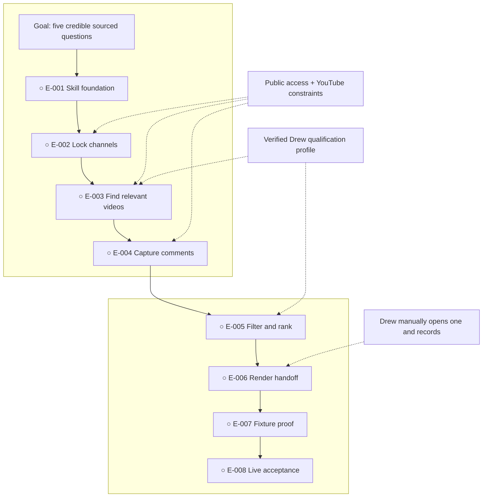

# Drew's YouTube Question Finder Skill

**Status:** awaiting approval

**Destination:** A portable natural-language skill that finds the five strongest short-video questions Drew can credibly answer from public comments on only the AI YouTube channels he names.

**Success:** Five distinct qualifying results match their public sources and required format, with zero out-of-scope channels or prohibited YouTube actions.

**Now:** Planning and factual research are complete; build authorization is blocked on Drew's explicit visual approval.

**Next:** Drew reviews this route and either approves it or requests a specific change.

**Text route:** Goal → skill foundation → lock supplied channels → find relevant videos → capture sourced comments → filter and rank → render five-result handoff → deterministic fixture proof → live read-only acceptance

## Step details

E-001 — Create the portable skill foundation

- Outcome: A valid, natural-language Agent Skill package encodes the complete contract and Drew-fit reference.
- Owner: Agent
- Inputs: [P-001 contract](decisions/P-001-define-finder-contract.md) and its evidence
- Proof: Package validation and contract coverage checks pass.
- If blocked or changed: Return to P-001 only if the portable package cannot express a confirmed behavior.

E-002 — Resolve and lock the supplied channels

- Outcome: Each supplied name becomes one canonical allowed channel, with ambiguity handled without guessing.
- Owner: Agent, with Drew only for an irreducibly ambiguous name
- Inputs: Natural-language channel list and E-001 behavior contract
- Proof: Resolution tests accept names/handles/URLs and reject lookalikes or ambiguous matches.
- If blocked or changed: Ask only for the unresolved channel's handle/URL; do not continue with that name guessed.

E-003 — Discover relevant videos within the lock

- Outcome: A balanced, recent-first pool of Drew-relevant videos comes only from locked channels.
- Owner: Agent
- Inputs: Allowed-channel set and Drew qualification profile
- Proof: Candidate fixtures contain no outside channel and preserve canonical video links.
- If blocked or changed: Record inaccessible channels/videos and continue only within the permitted bounded route.

E-004 — Capture comment candidates and provenance

- Outcome: Exact public comment text and source metadata are captured without posting or downloading media.
- Owner: Agent
- Inputs: Verified video pool and public comment pages
- Proof: Quotes, video links, and available highlighted-comment links round-trip to their source fixtures/pages.
- If blocked or changed: Mark disabled, unavailable, sign-in-gated, or un-linkable comments; never bypass the block.

E-005 — Filter, deduplicate, and rank questions

- Outcome: Only distinct, specific, useful questions Drew can credibly answer survive, with recent comments preferred and exceptional older ones allowed.
- Owner: Agent
- Inputs: Sourced candidates, rejection rules, and qualification profile
- Proof: Labeled spam, praise, trolls, duplicates, and credential traps are rejected; ranking fixtures order qualifying questions correctly.
- If blocked or changed: Return to P-001 only if qualification cannot be decided from substantiated profile evidence.

E-006 — Render the five-result handoff

- Outcome: The report contains every required field and gives Drew a direct manual path to one question.
- Owner: Agent produces; Drew selects and records manually
- Inputs: Ranked qualified questions and coverage/access notes
- Proof: Schema checks pass; unavailable comment links are explicit; no prohibited action is offered or taken.
- If blocked or changed: Return a transparent shortfall rather than pad the list.

E-007 — Prove behavior with deterministic fixtures

- Outcome: Repeatable tests cover success, rejection, ambiguity, provenance, recency, older exception, access failure, and fewer-than-five behavior.
- Owner: Agent
- Inputs: Complete skill package and synthetic/local fixtures
- Proof: All acceptance cases pass without network variability.
- If blocked or changed: Fix the owning implementation ticket; return to planning only for a genuine contract conflict.

E-008 — Run live read-only acceptance and package validation

- Outcome: One representative public run and clean-context install prove the package works within platform and harness limits.
- Owner: Agent, with Drew reviewing the final usefulness and opening one link
- Inputs: Validated package and a representative supplied channel group
- Proof: Package validator passes; live source links and quotes verify; Drew confirms one result is worth recording.
- If blocked or changed: Report the exact access/capability blocker without bypass; do not claim live acceptance.

## Plan-wide safety

- Only resolve, search, and return channels Drew supplied.
- Stay read-only: never reply, post, like, subscribe, download, record, publish, or schedule.
- Use no account or paid service in the core; never hide an API key requirement.
- Use only compliant public access and stop rather than scrape, evade controls, or bypass a block.
- Preserve exact quotes and provenance; never infer or invent a missing source.
- Never pad to five: disclose a qualified-result shortfall and its cause.

Details: [plan](PLAN.md) · [confirmed contract](decisions/P-001-define-finder-contract.md)
